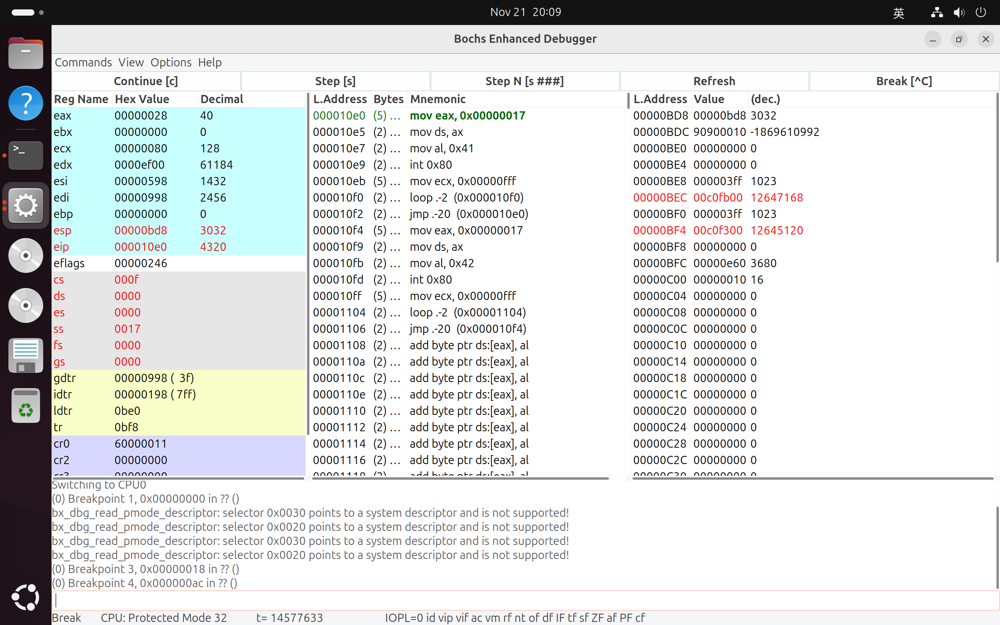
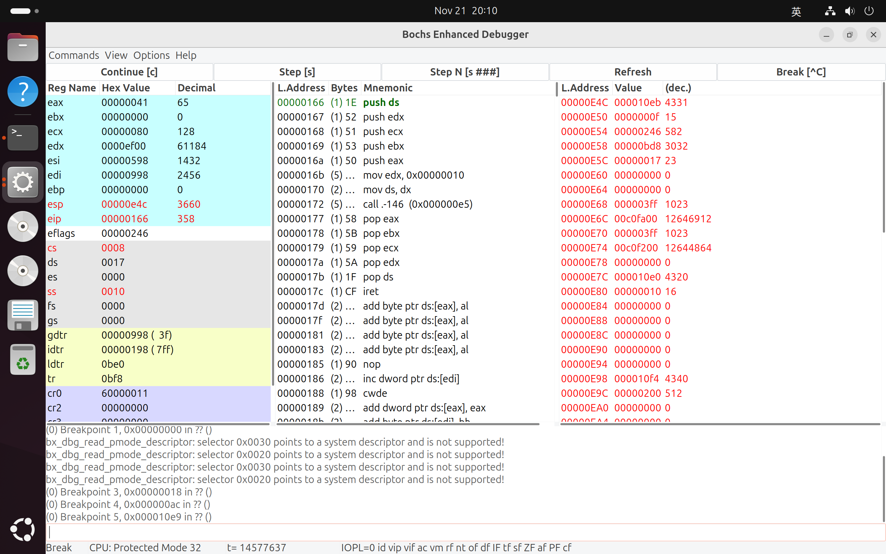

# Lab 1 调试分析 Linux 0.00 引导程序

## 实验环境

### Ubuntu 基础配置

本实验使用的操作系统为 `Ubuntu 24.04.1 (amd64, Desktop LiveDVD)`，为完成实验，安装以下软件包：

```bash
sudo apt install \
# 编辑器
vim \
# 版本管理
git \
# 脚本
zsh \
# 远程 ssh 连接
openssh-server \
# Bochs 安装编译环境
build-essential \
xorg-dev \
## Bochs GUI
libgtk2.0-dev \
libgtk-3-dev \
libxpm-dev \
libxrandr-dev \
# Bochs lab1 编译运行环境
## 编译 as86 程序
bin86 \
## 仿真运行
libcanberra-gtk-module
```

开启防火墙，同时为 `ssh` 放行：

```bash
sudo systemctl enable ssh
sudo systemctl start ssh
sudo ufw enable
sudo ufw allow ssh
```

### Bochs 下载安装

下载 [/bochs/2.8](https://sourceforge.net/projects/bochs/files/bochs/2.8/) 目录下的 `bochs-2.8.tar.gz` 到 `~/Download` 目录下（其他目录均可），解压到 `~/Software` 目录下：

```bash
tar -zxvf bochs-2.8.tar.gz -C ~/Software
```

解压出来新的目录 `bochs-2.8`，进入该目录，进行编译，命令如下：

```bash
cd bochs-2.8
./configure --prefix=~/Software/bochs --enable-debugger --enable-debugger-gui --enable-iodebug --enable-x86-debugger --with-x --with-x11
make
sudo make install
```

本实验使用 `zsh` 脚本工具，为了方便使用 `bochs` 命令，现为其添加环境变量：

```bash
vim ~/.zshrc
# 在文件最后一行后添加：
export PATH=$PATH:$HOME/Software/bochs/bin
export BXSHARE=$HOME/Software/bochs/share/bochs
source ~/.zshrc
```

### lab1 项目配置

为了便于管理，将 linux000 项目目录置于 `~/Documents/hit-os/common/Linux000`，我们进入到 `common` 目录，然后拉取远程仓库：

```bash
git clone https://gitee.com/guojunos/Linux000.git
```

进入 `Linux000 code` 目录下，编译 Linux000：

```bash
cd "Linux000/Linux000 code"
sudo make
```

将 `Image` 移至项目根目录：

```bash
mv ./Image ../Image
```

回到项目根目录，修改 `.bxrc` 文件如下：

```yaml
#=======================================================================
# ROMIMAGE:
# You now need to load a ROM BIOS into F0000-FFFFF.  I've wiped
# out most of the BIOS hooks, and replace them with real BIOS
# support.  Normally, you can use a precompiled BIOS in the bios/
# directory, named BIOS-bochs-yymmdd.  Use the latest one in there.
#=======================================================================
romimage: file=$BXSHARE/BIOS-bochs-latest
#, address=0xf0000
#romimage: file=$BXSHARE/BIOS-bochs-2-processors, address=0xf0000

#=======================================================================
# MEGS
# set this to the default number of Megabytes of memory you want
# to emulate.  You may also pass the '-megs xyz' option to bochs
# The default is 32MB, most OS's won't need more than that.
#=======================================================================
#megs: 64
megs: 16

#=======================================================================
# VGAROMIMAGE
# You now need to load a VGA ROM BIOS into C0000.
#=======================================================================
vgaromimage: file=$BXSHARE/VGABIOS-lgpl-latest
#vgaromimage: $BXSHARE\VGABIOS-elpin-2.40

#=======================================================================
# FLOPPYA:
# Point this to pathname of floppy image file or device
# This should be of a bootable floppy(image/device) if you're
# booting from 'a'.
#
# You can set the initial status of the media to 'ejected' or 'inserted'.
#   floppya: 2_88=path, status=ejected             (2.88M 3.5" floppy)
#   floppya: 1_44=path, status=inserted            (1.44M 3.5" floppy)
#   floppya: 1_2=path, status=ejected              (1.2M  5.25" floppy)
#   floppya: 720k=path, status=inserted            (720K  3.5" floppy)
#
# The path should be the name of a disk image file.  On unix, you can use
# a raw device name such as /dev/fd0 on Linux.  On WinNT and Win2k, use
# drive letters such as a: or b: as the path.  Raw floppy access is not
# supported on Windows 95 and 98.
#=======================================================================
#floppya: 1_44=/dev/fd0, status=inserted
#floppya: 1_44=a:, status=inserted             # for win32
floppya: 1_44="Image", status=inserted

#=======================================================================
# BOOT:
# This defines your boot drive.
# You can either boot from 'a', 'c' or 'cdrom'
# Examples:
#   boot: c
#   boot: a
#   boot: cdrom
#=======================================================================
boot: a
#boot: c

#=======================================================================
# LOG:
# Give the path of the log file you'd like Bochs debug and misc. verbage
# to be written to.  If you really don't want it, make it /dev/null. :^(
#
# Examples:
#   log: ./bochs.out
#   log: /dev/tty
#=======================================================================
#log: /dev/null
log: bochsout.txt

# windows
# config_interface: win32config
# display_library: win32, options="gui_debug"

# Linux
display_library: x, options="gui_debug"

# MacOS
# display_library: sdl2
```

接下来，利用 GUI 调试：

```bash
bochs -q -f linux000_gui.bxrc
```

## 实验内容

### 掌握如何手写 Bochs 虚拟机的配置文件

Bochs 的配置文件指定了从哪查找磁盘镜像，Bochs 仿真层如何工作等等。如果命令行未指定配置文件，且未禁用配置文件加载，Bochs 将按如下顺序搜索默认配置文件：

1. 当前目录下的 `.bochsrc`
2. 当前目录中的 `bochsrc`
3. 当前目录中的 `bochsrc.txt`
4. (仅限 Win32) 当前目录中的 `bochsrc.bxrc`
5. (仅限 Unix) 用户主目录中的 `.bochsrc`
6. (仅限 Unix) `/etc` 目录中的 `bochsrc`

以本实验的配置文件，进行具体配置项解读：

```
#=======================================================================
# ROMIMAGE:
# You now need to load a ROM BIOS into F0000-FFFFF.  I've wiped
# out most of the BIOS hooks, and replace them with real BIOS
# support.  Normally, you can use a precompiled BIOS in the bios/
# directory, named BIOS-bochs-yymmdd.  Use the latest one in there.
#=======================================================================
#
romimage: file=$BXSHARE/BIOS-bochs-latest
#, address=0xf0000
#romimage: file=$BXSHARE/BIOS-bochs-2-processors, address=0xf0000

#=======================================================================
# MEGS
# set this to the default number of Megabytes of memory you want
# to emulate.  You may also pass the '-megs xyz' option to bochs
# The default is 32MB, most OS's won't need more than that.
#=======================================================================
#megs: 64
megs: 16

#=======================================================================
# VGAROMIMAGE
# You now need to load a VGA ROM BIOS into C0000.
#=======================================================================
vgaromimage: file=$BXSHARE/VGABIOS-lgpl-latest
#vgaromimage: $BXSHARE\VGABIOS-elpin-2.40

#=======================================================================
# FLOPPYA:
# Point this to pathname of floppy image file or device
# This should be of a bootable floppy(image/device) if you're
# booting from 'a'.
#
# You can set the initial status of the media to 'ejected' or 'inserted'.
#   floppya: 2_88=path, status=ejected             (2.88M 3.5" floppy)
#   floppya: 1_44=path, status=inserted            (1.44M 3.5" floppy)
#   floppya: 1_2=path, status=ejected              (1.2M  5.25" floppy)
#   floppya: 720k=path, status=inserted            (720K  3.5" floppy)
#
# The path should be the name of a disk image file.  On unix, you can use
# a raw device name such as /dev/fd0 on Linux.  On WinNT and Win2k, use
# drive letters such as a: or b: as the path.  Raw floppy access is not
# supported on Windows 95 and 98.
#=======================================================================
#floppya: 1_44=/dev/fd0, status=inserted
#floppya: 1_44=a:, status=inserted             # for win32
floppya: 1_44="Image", status=inserted

#=======================================================================
# BOOT:
# This defines your boot drive.
# You can either boot from 'a', 'c' or 'cdrom'
# Examples:
#   boot: c
#   boot: a
#   boot: cdrom
#=======================================================================
boot: a
#boot: c

#=======================================================================
# LOG:
# Give the path of the log file you'd like Bochs debug and misc. verbage
# to be written to.  If you really don't want it, make it /dev/null. :^(
#
# Examples:
#   log: ./bochs.out
#   log: /dev/tty
#=======================================================================
#log: /dev/null
log: bochsout.txt

# windows
# config_interface: win32config
# display_library: win32, options="gui_debug"

# Linux
display_library: x, options="gui_debug"

# MacOS
# display_library: sdl2
```

#### ROM Image

ROM Image（只读存储器映像）用于指定 BIOS（基本输入输出系统）的映像文件。BIOS 是计算机启动时首先运行的软件，负责初始化硬件并启动操作系统。在 Bochs 中，ROM Image 配置项告诉模拟器使用哪个 BIOS 映像文件来模拟计算机的启动过程。

- `romimage: file=$BXSHARE/BIOS-bochs-latest`: 指定 BIOS 映像文件的路径。`$BXSHARE` 是一个环境变量，它指向 Bochs 的共享目录，其中包含了 BIOS 文件。`BIOS-bochs-latest` 表示使用最新版本的 Bochs BIOS 映像文件。
- `#, address=0xf0000`: 表明 ROM Image 通常被映射到内存地址 `0xF0000` 到 `0xFFFFF` 的区域。这个地址范围是 x86 架构中 BIOS 的标准地址范围。
- `#romimage: file=$BXSHARE/BIOS-bochs-2-processors, address=0xf0000`: 提供了一个备用的 BIOS 映像文件 `BIOS-bochs-2-processors`，这个文件可能是为特定硬件配置（例如双处理器系统）定制的 BIOS。

#### 内存配置

`megs` 用于设置虚拟机模拟的内存大小，单位是兆字节（MB）。这个值决定了虚拟机可以访问的内存总量，对于模拟的操作系统来说，相当于物理内存的大小。

#### VGA ROM Image

VGA ROM BIOS 是显卡的固件，负责控制显卡的初始化和基本操作。`VGAROMIMAGE` 指定要加载的 VGA ROM BIOS 映像文件。VGA ROM BIOS 通常被加载到内存的 `0xC0000` 地址开始的位置。这个地址范围是 x86 架构中 VGA BIOS 的标准地址范围。

#### 虚拟软驱配置

`FloppyA` 配置项在 Bochs 中用于设置虚拟软驱 A 的参数，包括软驱类型、软盘映像文件的路径以及软驱的初始状态：

- **虚拟软驱类型**：
    - `1_44`：表示 1.44MB 的 3.25 英寸软盘，这是最常见的软盘类型。
    - `2_88`：表示 2.88MB 的 3.25 英寸软盘。
    - `1_2`：表示 1.2MB 的 5.25 英寸软盘。
    - `720k`：表示 720KB 的 3.25 英寸软盘。
    - `360k`、`320k`、`180k`、`160k`：表示不同容量的 5.25 英寸软盘。
- **软盘映像文件路径**：`floppya: 1_44="Image", status=inserted` 中的 `"Image"` 是软盘映像文件的路径和名称。这意味着在虚拟机启动时，Bochs 会将这个映像文件加载到虚拟软盘驱动器 A 中。
- **软驱的初始状态**：`status=inserted` 表示虚拟软盘在虚拟机启动时被插入到驱动器中，以便虚拟机可以访问软盘上的内容。如果设置为 `status=ejected`，则表示软盘未被插入。
- **自动检测软盘介质类型**：使用 `image` 关键字可以让 Bochs 自动检测软盘介质类型，这通常用于软盘映像文件，不适用于原始软盘驱动器。在这种情况下，映像文件的大小必须与支持的类型之一匹配。

#### 启动设备配置

`BOOT` 配置项在 Bochs 中用于指定虚拟机的启动设备。

- `boot: floppy` 表示从虚拟软驱启动。如果配置了 `floppya` 并且有可启动的软盘映像，虚拟机将尝试从软驱启动。
- `boot: c` 表示从虚拟硬盘的 C 盘启动。这通常用于从硬盘上的操作系统启动。
- `boot: cdrom` 表示从虚拟光驱启动。

#### 日志文件配置

`log` 配置项用于指定日志文件的路径，这个日志文件记录了 Bochs 运行时的调试信息和各种输出信息。

- `log: bochsout.txt`: 将日志文件设置为当前目录下的 `bochsout.txt`。
- `log: /dev/null`: 如果不想保存日志信息，可将日志文件路径设置为 `/dev/null`（在类 Unix 系统中）
- `log: bochsout.txt, panic=panic.log`: 多文件日志配置。`bochsout.txt` 将包含常规的调试信息，而 `panic.log` 将专门用于记录严重错误（panic）信息。

#### 问题解答

##### 从软驱启动

```
# 指定启动顺序，先从软驱启动
boot: floppy
# 配置软驱 A
floppya: type=1_44, 1_44="a.img", status=inserted, write_protected=0
# type=1.44: 3.5英寸高密度软盘
# 1_44="a.img": 指定软盘映像文件路径
# status=inserted: 软盘已经被插入
# write_protected=0: 软盘是可写的
```

##### 从硬盘启动

```
# 指定启动顺序，先从硬盘启动
boot: disk

# 启用和配置 IDE 接口
ata0: enabled=1, ioaddr1=0x1f0, ioaddr2=0x3f0, irq=14
# enabled=1：启用该 IDE 接口
# ioaddr1：IDE 接口的 I/O 基地址 1，用于读写数据
# ioaddr2：IDE 接口的 I/O 基地址 2，用于控制
# irq：分配给该 IDE 接口的中断请求号

# 指定连接到 IDE 接口主、从设备的具体设备和参数
ata0-master: type=disk, mode=flat, path="h.img", cylinders=130, heads=16, spt=63
# type：指定连接的设备类型，disk 代表硬盘。
# path：硬盘映像文件的路径。
# mode：硬盘映像文件的模式，flat 表示硬盘映像是一个单一文件。
# cylinders、heads、spt：分别指定硬盘的柱面数、磁头数和每磁道扇区数。这些参数用于模拟硬盘的物理特性。
```

##### 调试选项设置

`debug` 配置项用于控制 Bochs 的调试输出和行为。以下是一些常用的 `debug` 配置选项：

- **`action` 参数**：定义了当调试事件发生时 Bochs 应该采取的动作。
    - `"ignore"`：不采取任何动作，忽略调试事件。
    - `"debug"`：打印所有调试信息。
    - `"panic"`：在调试事件发生时使虚拟机停止。
    - `"report"`：报告错误信息，但不停止虚拟机。
- **`bpoint` 参数**：用于设置断点。
    - `name`：断点的名称。
    - `type`：断点的类型，可以是 `address`（地址断点）或 `io`（I/O 断点）等。
    - `addr`：断点的地址。

```
debug: action="debug", option="all"
debug: action="bpoint", name="my_breakpoint", type=address, addr=0x1234
```

`display_library` 配置项用于指定显示库，即用于显示 Bochs VGA 屏幕的代码。Bochs 提供了大约 10 种不同的显示库实现，适用于不同的平台。如果配置 Bochs 时使用了多个 `--with-*` 选项，`display_library` 选项可以选择要使用的显示库。如果没有指定 `display_library`，Bochs 将选择一个默认值。

### 掌握 Bochs 虚拟机的调试技巧

#### 单步跟踪

- 命令：`s`
- GUI：`Step[s]`

#### 设置断点进行调试

- `b <address>`: 其中 `<address>` 指定设置断点的内存地址或符号
- `info break`: 列出当前设置的断点
- `d <断点号>`: 删除断点

#### 查看寄存器的值

相关命令如下所示：

- `info cpu`: 列出所有 CPU 寄存器及其内容。
- `info eflags`: 显示解码后的 EFLAGS 寄存器内容。
- `r`: 列出 CPU 的整数寄存器及其当前值。
- `fp`: 列出所有浮点处理单元寄存器的内容。
- `sreg`: 列出所有段寄存器（如 CS, DS 等）及其内容。
- `dreg`: 列出所有调试寄存器（如 DR0, DR1 等）及其内容。
- `creg`: 列出所有控制寄存器（如 CR0, CR3 等）及其内容。

下图是 debugger 的 gui：


界面左侧蓝色区域为通用寄存器信息，紫色区域为系统寄存器信息。

#### 查看内存指定位置的值

- `xp /nuf addr`: 查看内存物理地址内容
- `x /nuf addr`: 查看内存线性地址内容

其中：

- `n`（数量）：指定要显示的单位数量
- `u`（单位大小）：
    - `b`: 字节
    - `h`: 半字（2 字节）
    - `w`: 字（4 字节）
    - `g`: 巨字（8 字节）
- `f`（格式）：
    - `x`: 十六进制
    - `d`: 十进制
    - `u`: 无符号十进制
    - `o`: 八进制
    - `t`: 二进制

#### 查看各种表（gdt, idt, ldt）

- `info tab`: 显示页表地址转换信息。
- `info idt`: 显示中断描述符表（IDT）的内容。
- `info gdt`: 显示全局描述符表（GDT）的内容。
- `info ldt`: 显示局部描述符表（LDT）的内容。

以下通过 GUI 显示 GDT 与 IDT 内容：


#### 查看 TSS

- `info tss`: 查看 TSS 段

#### 查看栈中的内容

- `print-stack <num words>`: 打印栈顶的 `<num words>` 个 16 位字，`<num words>` 默认为 16。仅在受保护模式下且栈段的基地址为零时可靠工作。

也可在 GUI 的 View 中查看：


#### 在内存指定地方进行反汇编

- `u <start-address> <end-address>`: 在给定的线性地址范围内反汇编指令。包括 `<start-address>`，不包括 `<end-address>`。如果只想反汇编第一条指令，使用小于 `start`（或 0）的 `end` 值。

如图所示，执行 `u 0x0001 0x0013`。


## 实验报告

### 请简述 `head.s` 的工作原理

`head.s` 是 Linux 0.00 的核心程序，负责实现一个简单的多任务操作系统，包含两个在用户态（特权级 3）运行的任务（任务 A 和任务 B），通过时钟中断以每 10 毫秒为周期切换运行。这两个任务分别调用系统调用，在屏幕上显示字符 'A' 和 'B'。主要功能和流程包括：

1. **数据和结构初始化：** 定义并初始化 GDT、IDT、TSS、LDT 等关键数据结构。
2. **启动内核（`startup_32`）：**
    - 设置 GDT 和 IDT 表，加载到 GDTR 和 IDTR。
    - 初始化 8259A 中断控制器，开启时钟中断。
    - 配置 TSS 和 LDT，并加载到 TR 和 LDTR。
    - 调用 `switch_to` 函数切换到任务 A。
3. **任务切换（`switch_to`）：** 保存当前任务的状态，加载下一个任务的寄存器状态，通过 `ljmp` 指令切换代码段和栈。
4. **任务执行：** 任务 A 和 B 在用户态通过系统调用 `int 0x80` 实现屏幕字符显示。
5. **系统调用处理：**
    - 保存任务状态，验证调用号合法性。
    - 执行显示系统调用，更新显存以显示字符。
    - 恢复任务状态，通过 `iret` 返回用户态。
6. **时钟中断：**
    - 保存任务状态，发送 EOI 命令结束中断。
    - 调用 `switch_to` 实现任务切换。
    - 使用 `iret` 返回用户态继续运行新任务。

### 请记录 `head.s` 的内存分布状况，写明每个数据段，代码段，栈段的起始与终止的内存地址

内核映象文件和内存中 `head` 代码数据分布如下图所示：


下图是段描述符的具体结构，后文将基于此展开分析。


首先，分析 GDT 中段选择子指向的段：

```assembly
SCRN_SEL = 0x18
TSS0_SEL = 0x20
LDT0_SEL = 0x28
TSS1_SEL = 0X30
LDT1_SEL = 0x38

gdt:
    .quad 0x0000000000000000    /* NULL descriptor */
    .quad 0x00c09a00000007ff    /* 内核代码段 (0x08) */
    .quad 0x00c09200000007ff    /* 内核数据段 (0x10) */
    .quad 0x00c0920b80000002    /* 显存段 (0x18) */

    .word 0x0068, tss0, 0xe900, 0x0    # TSS0 描述符 (0x20)
    .word 0x0040, ldt0, 0xe200, 0x0    # LDT0 描述符 (0x28)
    .word 0x0068, tss1, 0xe900, 0x0    # TSS1 描述符 (0x30)
    .word 0x0040, ldt1, 0xe200, 0x0    # LDT1 描述符 (0x38)
```

1. 内核代码段：`.quad 0x00c09a00000007ff`
    - **Base (基地址):** 0x000000
    - **Limit (段限长):** 0x007FF（粒度为 4KB，总大小 = (0x007FF + 1) * 4KB = 8MB）
    - **Access Byte:** 0x9A (1001 1010)
        - P（存在位，位 7）= 1：段存在
        - DPL（描述符特权级，位 6-5）= 00：内核态（特权级 0）
        - S（段类型标志，位 4）= 1：数据/代码段
        - Type（类型位，位 3-0）= 1010：可执行、不可向下扩展、已访问
    - **Flags:** 0xC
        - G=1：粒度 4KB
        - D/B=1：32 位操作
2. 内核数据段：`.quad 0x00c09200000007ff`
    - **Base (基地址):** 0x000000
    - **Limit (段限长):** 0x007FF（粒度为 4KB，总大小 = (0x007FF + 1) * 4KB = 8MB）
    - **Access Byte:** 0x92 (1001 0010)
        - P（存在位，位 7）= 1：段存在
        - DPL（描述符特权级，位 6-5）= 00：内核态（特权级 0）
        - S（段类型标志，位 4）= 1：数据/代码段
        - Type（类型位，位 3-0）= 0010：可读写、不可向下扩展、未访问
    - **Flags:** 0xC
        - G=1：粒度 4KB
        - D/B=1：32 位操作
3. 显存段：`.quad 0x00c0920b80000002`
    - **Base (基地址):** 0x0B8000
    - **Limit (段限长):** 0x00002（粒度为 1B，总大小 = (0x00002 + 1) * 4KB = 12KB）
    - **Access Byte:** 0x92 (1001 0010)
        - P（存在位，位 7）= 1：段存在
        - DPL（描述符特权级，位 6-5）= 00：内核态（特权级 0）
        - S（段类型标志，位 4）= 1：数据/代码段
        - Type（类型位，位 3-0）= 0010：可读写、不可向下扩展、未访问
    - **Flags:** 0xC
        - G=1：粒度 4KB
        - D/B=1：32 位操作

然后，结合代码分析 LDT 中的 Task 代码/数据段。

```asm
ldt0:
    .quad 0x0000000000000000           /* NULL descriptor */
    .quad 0x00c0fa00000003ff           /* Task0 代码段 (0x0F) */
    .quad 0x00c0f200000003ff           /* Task0 数据段 (0x17) */

ldt1:
    .quad 0x0000000000000000           /* NULL descriptor */
    .quad 0x00c0fa00000003ff           /* Task1 代码段 (0x0F) */
    .quad 0x00c0f200000003ff           /* Task1 数据段 (0x17) */
```

1. Task0 数据段：`.quad 0x00c0f200000003ff`
    - **Base (基地址):** 0x000000
    - **Limit (段限长):** 0x003FF（粒度为 4KB，总大小 = (0x003FF + 1) * 4KB = 4MB）
    - **Access Byte:** 0xF2 (1111 0010)
        - P（存在位，位 7）= 1：段存在
        - DPL（描述符特权级，位 6-5）= 11：用户态（特权级 3）
        - S（段类型标志，位 4）= 1：数据/代码段
        - Type（类型位，位 3-0）= 0010：可读写、不可执行、未访问
    - **Flags:** 0xC
        - G=1：粒度 4KB
        - D/B=1：32 位操作
2. Task0 代码段：`.quad 0x00c0fa00000003ff`
    - **Base (基地址):** 0x000000
    - **Limit (段限长):** 0x003FF（粒度为 4KB，总大小 = (0x003FF + 1) * 4KB = 4MB）
    - **Access Byte:** 0xFA (1111 1010)
        - P（存在位，位 7）= 1：段存在
        - DPL（描述符特权级，位 6-5）= 11：用户态（特权级 3）
        - S（段类型标志，位 4）= 1：数据/代码段
        - Type（类型位，位 3-0）= 1010：可执行、不可向下扩展、未访问
    - **Flags:** 0xC
        - G=1：粒度 4KB
        - D/B=1：32 位操作
3. Task1 数据段：`.quad 0x00c0f200000003ff`
    - **Base (基地址):** 0x000000
    - **Limit (段限长):** 0x003FF（粒度为 4KB，总大小 = (0x003FF + 1) * 4KB = 4MB）
    - **Access Byte:** 0xF2 (1111 0010)
        - P（存在位，位 7）= 1：段存在
        - DPL（描述符特权级，位 6-5）= 11：用户态（特权级 3）
        - S（段类型标志，位 4）= 1：数据/代码段
        - Type（类型位，位 3-0）= 0010：可读写、不可执行、未访问
    - **Flags:** 0xC
        - G=1：粒度 4KB
        - D/B=1：32 位操作
4. Task1 代码段：`.quad 0x00c0fa00000003ff`
    - **Base (基地址):** 0x000000
    - **Limit (段限长):** 0x003FF（粒度为 4KB，总大小 = (0x003FF + 1) * 4KB = 4MB）
    - **Access Byte:** 0xFA (1111 1010)
        - P（存在位，位 7）= 1：段存在
        - DPL（描述符特权级，位 6-5）= 11：用户态（特权级 3）
        - S（段类型标志，位 4）= 1：数据/代码段
        - Type（类型位，位 3-0）= 1010：可执行、不可向下扩展、未访问
    - **Flags:** 0xC
        - G=1：粒度 4KB
        - D/B=1：32 位操作

最后，分析栈段：

```asm
/*********************************************/
    .fill 128,4,0       # 初始内核堆栈空间
init_stack:             # 刚进入保护模式时用于加载 SS:ESP 堆栈指针值
    .long init_stack    # 堆栈段偏移位置
    .word 0x10          # 堆栈段同内核数据段
/*********************************************/
tss0:
    .long 0                /* back link */
    .long krn_stk0, 0x10   /* esp0, ss0 (内核栈基址) */
    .long 0, 0, 0, 0, 0    /* esp1, ss1, esp2, ss2, cr3 */
    .long 0, 0, 0, 0, 0    /* eip, eflags, eax, ecx, edx */
    .long 0, 0, 0, 0, 0    /* ebx, esp, ebp, esi, edi */
    .long 0, 0, 0, 0, 0, 0 /* es, cs, ss, ds, fs, gs */
    .long LDT0_SEL, 0x8000000 /* ldt, trace bitmap */ 
    
    .fill 128,4,0          # 任务 0 的内核栈空间
krn_stk0:
/*********************************************/
tss1:
    .long 0                /* back link */
    .long krn_stk1, 0x10   /* esp0, ss0 (内核栈基址) */
    .long 0, 0, 0, 0, 0    /* esp1, ss1, esp2, ss2, cr3 */
    .long task1, 0x200     /* eip, eflags */
    .long 0, 0, 0, 0       /* eax, ecx, edx, ebx */
    .long usr_stk1, 0, 0, 0 /* esp, ebp, esi, edi */
    .long 0x17,0x0fx17,0x17,0x17,0x17 /* es, cs, ss, ds, fs, gs */
    .long LDT1_SEL, 0x8000000 /* ldt, trace bitmap */

    .fill 128,4,0          # 任务 1 的内核栈空间。其用户栈直接使用初始栈空间
krn_stk1:
/*********************************************/
    .fill 128,4,0          # 任务 1 的用户栈空间
usr_stk1:
```

- 内核栈段：GDT 0x10
    - 栈顶为 `init_stack`
    - 空间为 512B
- 任务 0 的内核栈段：GDT 0x10
    - 栈顶为 `krn_stk0`
    - 空间为 512B
- 任务 1 的内核栈段：GDT 0x10
    - 栈顶为 `krn_stk1`
    - 空间为 512B
- 任务 0 的用户栈段：LDT0 0x17
    - 栈顶为 `init_stack`
    - 空间为 512B
- 任务 1 的用户栈段：LDT1 0x17
    - 栈顶为 `usr_stk1`
    - 空间为 512B

数据代码段总结如下：

| 段          | 段选择子      | 起始地址     | 终止地址     | 段大小  |
| :--------- | :-------- | :------- | :------- | :--- |
| 内核代码段      | GDT 0x08  | 0x000000 | 0x7FFFFF | 8MB  |
| 内核数据段      | GDT 0x10  | 0x000000 | 0x7FFFFF | 8MB  |
| 显存段        | GDT 0x18  | 0x0B8000 | 0x0BAFFF | 12KB |
| Task 0 代码段 | LDT0 0x0F | 0x000000 | 0x3FFFFF | 4MB  |
| Task 0 数据段 | LDT0 0x17 | 0x000000 | 0x3FFFFF | 4MB  |
| Task 1 代码段 | LDT1 0x0F | 0x000000 | 0x3FFFFF | 4MB  |
| Task 1 数据段 | LDT1 0x17 | 0x000000 | 0x3FFFFF | 4MB  |

接下来，利用 Bochs 对部分理论分析进行验证。在未执行 `call setup_gdt` 前，`GDT` 如图所示：


执行之后，如图所示：


由图可知，`GDT` 中的 `0x08`, `0x10`, `0x18` 与我们的分析结果完全一致。对于剩余部分，即堆栈段以及任务的数据/代码段，可通过查看 `IDT` 进行验证，此处不再赘述。

### 简述 `head.s` `57` 至 `62` 行在做什么

这段代码通过设置必要的寄存器值，将控制权转移给任务 0（`task0`），并且从内核态（特权级 0）切换到用户态（特权级 3）。通过模拟中断返回 (`iret`) 的堆栈恢复机制，构造一个任务的执行环境，最终实现从内核切换到用户空间的任务执行。

```asm
pushl $0x17        # 把任务 0 当前局部空间数据段（堆栈段）选择符入栈。
pushl $init_stack  # 把堆栈指针入栈（也可以直接把 ESP 入栈）。
pushfl             # 把标志寄存器值入栈。
pushl $0x0f        # 把当前局部空间代码段选择符入栈。
pushl $task0       # 把代码指针入栈。
iret               # 执行中断返回指令，从而切换到特权级 3 的任务 0 中执行。
```

| 行数  | 代码                  | 目的                                                                         |
| :-- | :------------------ | :------------------------------------------------------------------------- |
| 57  | `pushl $0x17`       | 将任务 0 的用户堆栈段选择子（`0x17`）压入堆栈，供 `iret` 设置 `SS`，指向任务 0 的用户堆栈段                 |
| 58  | `pushl $init_stack` | 将任务 0 的用户堆栈指针地址（`init_stack`）压入堆栈，供 `iret` 设置 `ESP`，指向任务 0 的用户堆栈           |
| 59  | `pushfl`            | 将标志寄存器值压入堆栈，供 `iret` 恢复到 `EFLAGS`                                          |
| 60  | `pushl $0x0f`       | 将任务 0 的用户代码段选择子（`0x0f`）压入堆栈，供 `iret` 设置 `CS`，指向任务 0 的第一条指令                 |
| 61  | `pushl $task0`      | 将任务 0 的入口地址（`task0` 标签地址）压入堆栈，供 `iret` 设置 `EIP`，指向任务 0 的用户代码段              |
| 62  | `iret`              | 恢复堆栈中的寄存器值（`SS`, `ESP`, `EFLAGS`, `CS`, `EIP`），完成从内核态到用户态的切换，并开始执行任务 0 的代码 |

段选择子 `0x17` 与 `0x0f` 的结构（结合 GDT 和 `ldt0` 的描述符解析）如下：

```txt
0x17 = 0b00010111
- Index: 0x2  （对应 LDT 的第二个描述符）
- TI: 1       （使用 LDT 而非 GDT）
- RPL: 3      （特权级 3，用户态）

0x0f = 0b00001111
- Index: 0x1  （对应 LDT 的第一个描述符）
- TI: 1       （使用 LDT 而非 GDT）
- RPL: 3      （特权级 3，用户态）
```

`iret` 从堆栈中按照以下顺序弹出并设置寄存器：

1. 弹出到 `EIP`（指令指针）：跳转到任务 0 的入口地址（`task0`）。
2. 弹出到 `CS`（代码段选择子）：切换到任务 0 的用户代码段（`0x0f`）。
3. 弹出到 `EFLAGS`（标志寄存器）：恢复任务的标志位。
4. 弹出到 `ESP`（堆栈指针）：指向任务 0 的用户堆栈（`init_stack`）。
5. 弹出到 `SS`（堆栈段选择子）：切换到任务 0 的用户堆栈段（`0x17`）。

由于 `CS` 和 `SS` 的段选择子特权级是 3（用户态），这会触发从特权级 0（内核态）到特权级 3（用户态）的特权级切换。

### 简述 `iret` 执行后，`pc` 如何找到下一条指令

`iret` 指令从堆栈中以固定顺序弹出寄存器的值，恢复任务的执行上下文。堆栈中的内容是在之前通过 `push` 指令压入的，顺序如下：

1. 弹出 **`EIP`**（程序计数器），设置为任务的代码入口地址。
2. 弹出 **`CS`**（代码段选择子），确定任务的代码段基址和特权级。
3. 弹出 **`EFLAGS`**（标志寄存器），恢复任务的标志状态。
4. 如果发生特权级切换（例如从特权级 0 切换到特权级 3），额外弹出：
    - **`ESP`**（堆栈指针），设置为任务的用户态堆栈指针。
    - **`SS`**（堆栈段选择子），确定任务的用户态堆栈段。

弹出的第一个值是任务的 `EIP` ，即任务下一条要执行的指令的地址。`iret` 将堆栈中的第一个值赋值给 `EIP`，此时程序计数器指向任务代码的入口地址，即 `task0`。接下来，弹出 `CS`，计算下一条指令的物理地址：$\text{物理地址} = \text{CS 段基址} + \text{EIP}$

### 记录 `iret` 执行前后，栈是如何变化的

如图所示，执行 `iret` 前，栈顶 `ss:esp=0x0010:0x0bc4`。同时，可以看到先前压入的跳转目标地址 `0x0f:0x10e0(task0)` 与用户栈栈顶地址 `0x17:0x0bd8(init_stack)`.


Bochs 中输入命令 `s`，进行单步执行，发现 `ss:esp=0x17:0x0bd8(init_stack)`, `cs:eip=0x0f:0x10e0(task0)`



### 当任务进行系统调用时，即 `int 0x80` 时，记录栈的变化情况

执行前，栈顶 `ss:esp=0x0017:0x0bd8`, `cs:eip=0x000f:0x10e9`。


执行后，栈顶切换到 Task0 的内核栈 `ss:esp=0x0010:0x0e4c`, `cs:eip=0x0008:0x0166` 指向系统调用中断处理服务程序入口地址。原用户栈栈顶地址 `0x0017:0x0bd8` 与中断返回地址 `0x000f:0x10eb` 被压入内核栈栈顶。



## Reference

- [虚拟机(ubuntu22.04)安装与配置bochs - Dylaris - 博客园](https://www.cnblogs.com/dylaris/p/18342018)
- [Bochs模拟器中文文档-CSDN博客](https://blog.csdn.net/qq_61653333/article/details/136962598)
- [Chapter 8. The Bochs internal debugger (New Bochs Documentation)](https://bochs.sourceforge.io/cgi-bin/topper.pl?name=New+Bochs+Documentation&url=https://bochs.sourceforge.io/doc/docbook/user/index.html)
