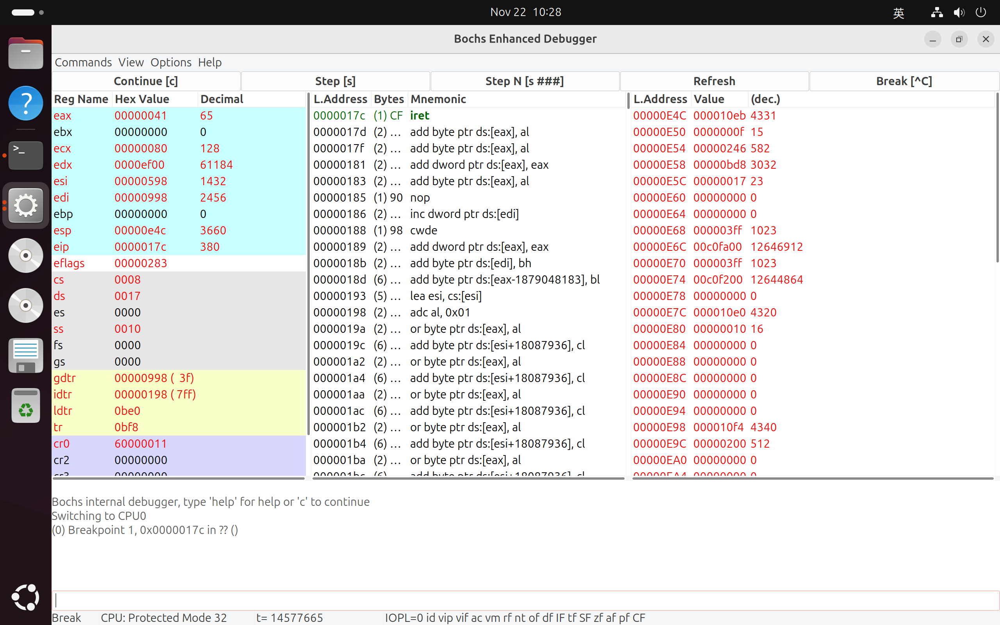
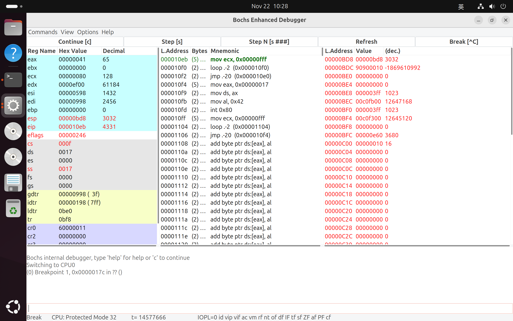
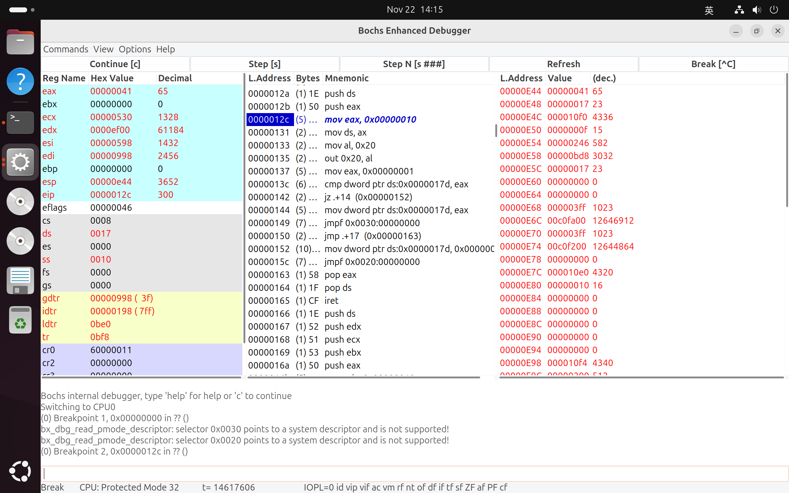
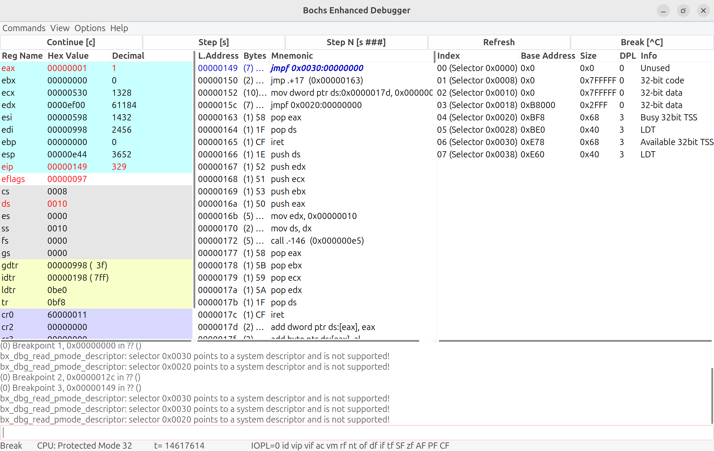
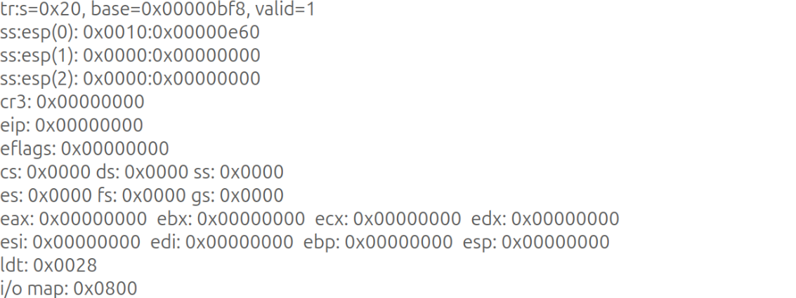
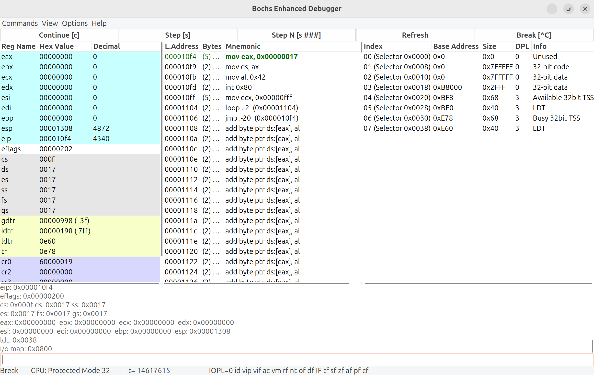
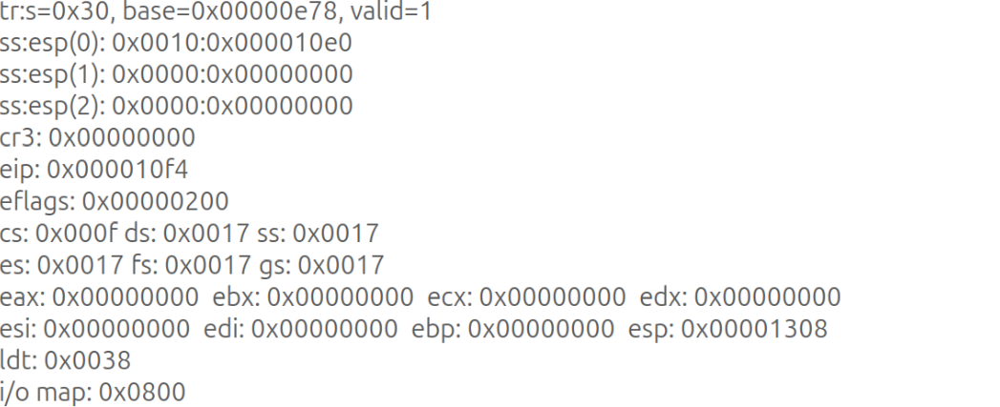
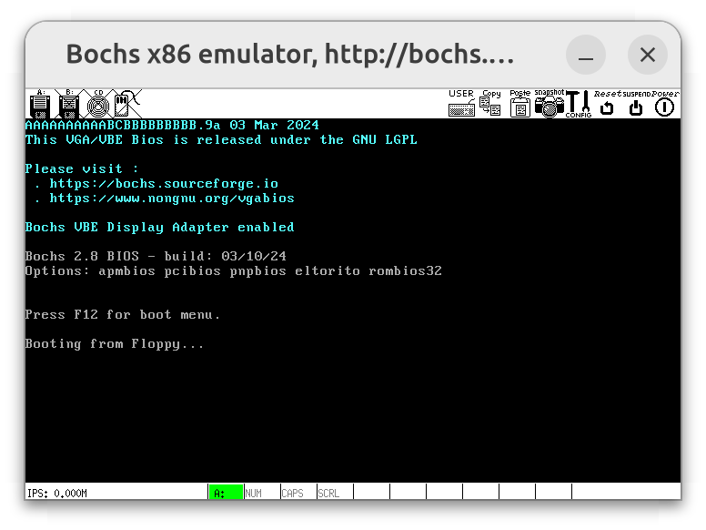
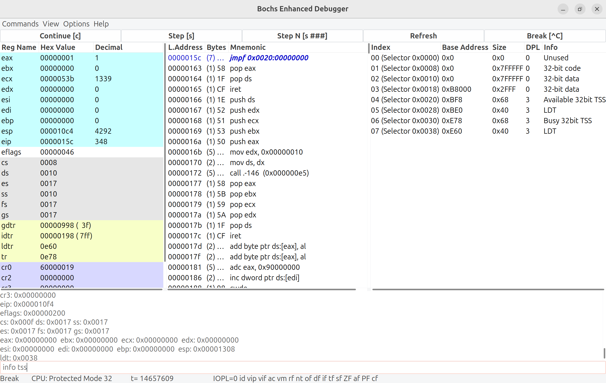
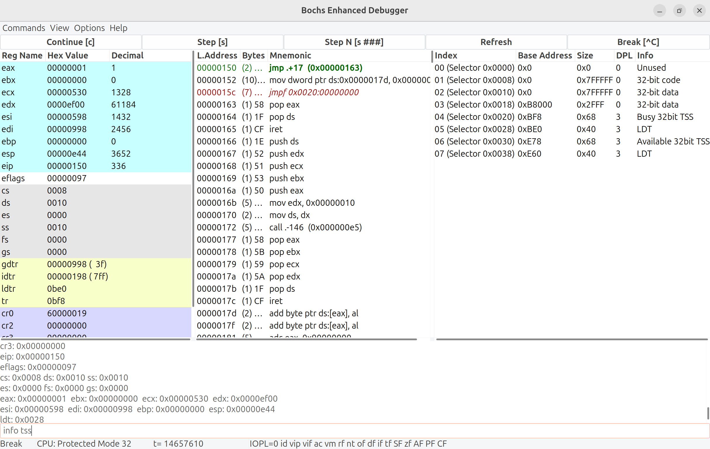

# Lab 2 调试分析 Linux 0.00 多任务切换

## 当执行完 `system_interrupt` 函数，执行 `153` 行 `iret` 时，记录栈的变化情况

相关代码如下：

```assembly
/* system call handler */
.align 2
system_interrupt:
    push %ds
    pushl %edx
    pushl %ecx
    pushl %ebx
    pushl %eax
    movl $0x10, %edx
    mov %dx, %ds
    call write_char
    popl %eax
    popl %ebx
    popl %ecx
    popl %edx
    pop %ds
    iret
```

`iret` 从堆栈中按照以下顺序弹出并设置寄存器：

1. 弹出指令指针 `EIP`：恢复中断返回地址，即程序被中断时的下一条指令的地址
2. 弹出代码段寄存器 `CS`：恢复中断处理程序返回的代码段
3. 弹出标志寄存器 `EFLAGS`：恢复中断前的标志状态
4. 如果发生特权级切换，额外弹出堆栈指针 `ESP` 与堆栈段寄存器 `SS`：恢复中断前的堆栈状态

接下来，通过 Bochs 调试进行验证。通过 `b 0x17c` 设置断点，通过 `c` 跳转到 `iret` 执行前。此时，寄存器与堆栈状态如下：



由右侧栈区域可知：

- 中断返回地址：`eip:cs=0x10eb:0x000f`
- 用户栈栈顶：`ss:esp=0x0017:0x0bd8`（与左侧寄存器区域相同）

然后，通过 `s` 单步执行。此时，寄存器与堆栈状态如下：



由左侧寄存器区域可知：

- 中断返回地址：`eip:cs=0x10eb:0x000f`
- 切换至用户栈栈顶：`ss:esp=0x0017:0x0bd8`

二者均与 `iret` 执行前的右侧栈区域相同。

## 当进入和退出 `system_interrupt` 时，都发生了模式切换，请总结模式切换时，特权级是如何改变的？栈切换吗？如何进行切换的？

1. 进入 `system_interrupt`
    - 特权级切换：用户态程序通过 `int 0x80` 调用系统中断，用户态（特权级 3）$\to$ 内核态（特权级 0）
    - 栈切换：CPU 自动从 TSS 中加载内核态的 SS 与 ESP，并将用户态的 SS, ESP, EFLAGS, CS, EIP 压入内核栈
2. 退出 `system_interrupt`
    - 特权级切换：内核态程序通过 `iret` 返回用户态程序，内核态（特权级 0）$\to$ 用户态（特权级 3）
    - 栈切换：CPU 自动从内核栈弹出用户态的 SS, ESP, EFLAGS, CS, EIP，并加载相应寄存器

## 当时钟中断发生，进入到 `timer_interrupt` 程序，请详细记录从任务 0 切换到任务 1 的过程

相关代码如下：

```assembly
/* Timer interrupt handler */
.align 2
timer_interrupt:
    push %ds
    pushl %eax
    movl $0x10, %eax    # 首先让 DS 指向内核数据段。
    mov %ax, %ds
    movb $0x20, %al     # 然后立刻允许其他硬件中断，即向 8259A 发送 EOI 命令
    outb %al, $0x20
    movl $1, %eax       # 接着判断当前任务，若是任务 1 则去执行任务 0，或反之
    cmpl %eax, current
    je 1f
    movl %eax, current  # 若当前任务是 0，则把 1 存入 current，并跳转到任务 1
    ljmp $TSS1_SEL, $0  # 去执行。注意跳转的偏移值无用，但需要写上。
    jmp 2f
1:  movl $0, current    # 若当前任务是 1，则把 0 存入 current，并跳转到任务 0
    ljmp $TSS0_SEL, $0  # 去执行
2:  popl %eax
    pop %ds
    iret
```

为了便于调试，在 `movl $0x10, %eax` 处打断点，接着 `continue` 执行，进入时间片中断处理程序，如下图所示：



从 Task 0 切换至 Task 1 的关键代码为 `ljmp $TSS1_SEL, $0`，对应 Bochs 的 `0x008:0x149 jmpf 0x30:0x00`。首先，分析 `ljmp $TSS1_SEL, $0` 执行细节：

1. **通过 GDT 找到目标 TSS 段描述符**：`TSS1_SEL = 0x30` 是 GDT 中的选择子。处理器根据选择子的索引（`0x30 >> 3 = 6`）访问 GDT 中第 6 个条目，取出描述符。
2. **加载新的 TSS**：
    - 使用描述符中的基地址，找到目标 TSS 段所在的内存地址。
    - 将当前任务的状态保存到当前 TSS。
    - 从目标 TSS 中加载新任务的寄存器上下文，包括：
        - CS（代码段选择子）、EIP（指令指针）：确定执行起点。
        - SS（堆栈段选择子）、ESP（栈指针）：初始化任务的栈。
        - 其他通用寄存器（如 EAX、EBX 等）。
        - 段寄存器（如 DS、ES 等）。

简而言之，硬件自动完成以下任务切换过程：

- 任务 0 的状态被保存到 `TSS0`。
- 任务 1 的上下文被从 `TSS1` 加载。
- 跳转到任务 1 的起始指令位置（`task1`）。

接下来，在此处设置断点，`continue` 执行，如下图所示：



- 查看右侧 GDT 表：0x30 对应一个 Available 32bit TSS，即为目标 Task1 的 TSS 段
- 查看当前 TSS 信息：`info tss` 展示 TSS0 的信息，如下图所示：



执行后，跳转到 Task1 程序入口处，如下图所示：



由右侧 GDT 可见：

- `0x20`: TSS0 处于 Available 状态
- `0x30`: TSS1 处于 Busy 状态

然后，`info tss` 查看当前 TSS（即 TSS1）信息，如下：



上图表明：各 TSS1 中寄存器的值，与当前寄存器的值对应。这意味着，任务 0 切换至任务 1 后，TSS1 重新加载了寄存器。

## 又过了 `10ms`，从任务 1 切换回到任务 0，整个流程是怎样的？`TSS` 是如何变化的？各个寄存器的值是如何变化的？

先前，我们已经在时间片中断处理程序中 `movl $0x10, %eax` 的指令处设置断点，`continue` 运行，可以看到输出了一些字符 `B`。



接下来，在 `ljmp $TSS0_SEL, $0` 指令处设置断点，对应 Bochs 的 `0x008:0x15c jmpf 0x20:0x00`，如下图所示：



执行前，查看右侧 GDT 表：

- `0x20`: TSS0 处于 Available 状态
- `0x30`: TSS1 处于 Busy 状态

下方 `info tss` 也输出了当前 TSS（即 TSS 1）的信息。接下来，我们单步执行，如下图所示：



执行后，查看右侧 GDT 表：

- `0x20`: TSS0 处于 Busy 状态
- `0x30`: TSS1 处于 Available 状态

下方 `info tss` 也输出了当前 TSS（即 TSS 0）的信息。与左侧寄存器相关值对应，意味着任务 1 切换回任务 0 后，TSS0 重新加载了寄存器。

## 请详细总结任务切换的过程

任务切换的核心在于时钟中断 `timer_interrupt`，通过中断和硬件支持切换任务，大概步骤如下：

1. 保存当前任务状态。
2. 确定下一个任务。
3. 加载新任务的 TSS，切换到新任务。

具体来说：

1. 保护现场：
    1. 时钟中断触发时：CPU 自动保存以下内容到内核栈中：
        - 指令指针 `EIP` 和代码段选择子 `CS`：中断触发时正在执行的指令地址和代码段
        - 标志寄存器 `EFLAGS`：当时的状态标志信息
        - 栈指针 `ESP` 和栈段选择子 `SS`（如果发生特权级切换）：记录用户态的栈信息
    2. 时钟中断程序执行时：手动保存以下内容到内核栈中：
        - 通用寄存器 `EAX`、`EBX`、`ECX`、`EDX`、`ESI`、`EDI`、`EBP`
        - 段寄存器 `DS`、`ES`、`FS`、`GS`
2. 保存当前任务：将当前任务的寄存器上下文保存到当前任务的 `TSS` 中
3. 确定下一任务：通过 `GDT` 找到下一任务 `TSS` 段描述符
4. 加载新的任务：从新任务 `TSS` 中加载新任务的寄存器上下文
5. 执行新的任务：任务切换结束后，`CS:EIP` 已经指向新任务程序的入口地址
