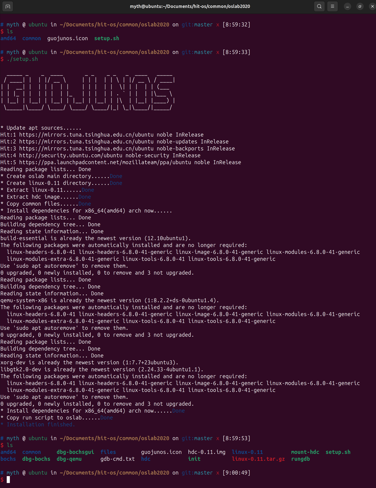
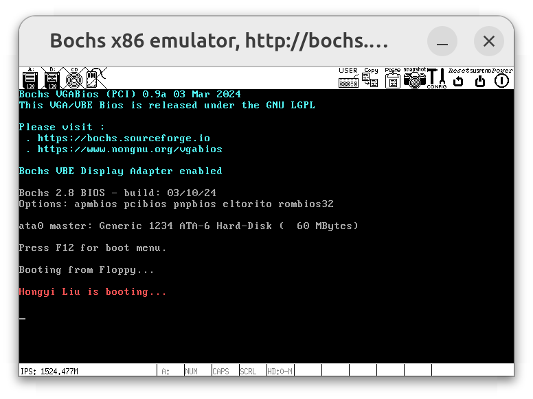

# Lab 3 操作系统的引导

## 实验环境

查询 [Download QEMU](https://www.qemu.org/download/#linux) 官方下载网址可知，可以通过如下方式安装 qemu：

```bash
sudo apt install qemu-system
```

接着，拉取官方仓库，对 `setup.sh` 进行微小改动，如下：

```diff
%% 根据自己目录需求配置 %%
- export OSLAB_INSTALL_PATH=$HOME/oslab
+ export OSLAB_INSTALL_PATH=$PWD

%% 由于 lab1 已经配置过 Bochs 环境 %%
-     sudo apt-get -y install bochs bochs-x bochs-sdl
```

运行 `setup.sh` 来初始化实验环境，如下：



## 实验内容

### 改写 `bootsect.s`

本节需实现功能：`bootsect.s` 能在屏幕上打印一段提示信息，如下：

```bash
XXX is booting... # XXX is your name
```

该功能的实现分为以下几步：

1. 修改 `msg1` 中的内容
2. 修改显示的字符数
3. 修改显示字体的颜色

具体实现如下：

```assembly
ok_load_setup:
    # 打印启动信息
    mov $0x03, %ah            # 读取光标位置
    xor %bh, %bh
    int $0x10                 # 调用 BIOS 中断
    mov $30, %cx              # 30 是显示信息的 ASCII 码字符数
    mov $0x000c, %bx          # 修改字体颜色 - 0x000c 为红色
    mov $msg1, %bp
    mov $0x1301, %ax          # 写字符串，移动光标
    int $0x10                 # 调用 BIOS 中断

    ljmp $SETUPSEG, $0

msg1:                                    # 调用 BIOS 中断显示的信息
    .byte 13,10                          # 回车换行
    .ascii "Hongyi Liu is booting..."    # 打印消息
    .byte 13,10,13,10                    # 共 30 个字符

    .org 510                             # 填充到 510 字节
```

接下来，在开发环境编译运行，步骤如下：

```bash
# 假设当前位于 src/linux-0.11/boot 目录
make bootsect # 此时将生成执行文件 `bootsect`

# 将执行文件 `bootsect` 移动至 linux-0.11目录，命名为 Image
mv ./bootsect ../Image

# 回到 src 目录，运行 Bochs
cd ../..
./dbg-bochs
```

结果如下：



### 改写 `setup.s`

本节需实现以下功能：

1. `bootsect.s` 能完成 `setup.s` 的载入，并跳转到 `setup.s` 开始地址执行。而 `setup.s` 向屏幕输出一行 `Now we are in SETUP`
2. `setup.s` 能获取至少一个基本的硬件参数（如内存参数、显卡参数、硬盘参数等），将其存放在内存的特定地址，并输出到屏幕上。
3. `setup.s` 不再加载 Linux 内核，保持上述信息显示在屏幕上即可。

#### 功能 1: `bootsect.s` 载入 `setup.s`

仿照 `bootsect` 屏幕输出的实现，给出 `setup` 的实现如下：

```assembly
# 打印启动信息
print_boot_info:
    mov $0x03, %ah        # 读取光标位置
    xor %bh, %bh
    int $0x10
    mov $25, %cx          # 设置 CX 寄存器为 25
    mov $0x000c, %bx      # 页面 0，属性 0x0c
    mov $msg2, %bp        # 将消息地址加载到 BP 寄存器
    mov $0x1301, %ax      # 写字符串，移动光标
    int $0x10             # 调用 BIOS 中断
    ret

# 启动信息
msg2:
    .byte 13,10
    .ascii "Now we are in SETUP"
    .byte 13,10,13,10
```

修改后，准备编译运行。首先，修改 `linux-0.11/Makefile` 文件，如下：

```makefile
Image: boot/bootsect boot/setup
    @tools/build.sh boot/bootsect boot/setup none Image $(ROOT_DEV)
    @sync
```

接着，删除 `linux-0.11/tools/build.sh` 中与 `system` 相关的内容，如下：

```diff
- # Set the biggest sys_size
- # Changes from 0x20000 to 0x30000 by tigercn to avoid oversized code.
- SYS_SIZE=$((0x3000*16))

- # Write system(< SYS_SIZE) to stdout
- [ ! -f "$system" ] && echo "there is no system binary file there" && exit -1
- system_size=`wc -c $system |cut -d" " -f1`
- [ $system_size -gt $SYS_SIZE ] && echo "the system binary is too big" && exit -1
- dd if=$system seek=5 bs=512 count=$((2888-1-4)) of=$IMAGE 2>&1 >/dev/null
```

此时，便可编译运行，步骤如下：

```bash
# 假设当前位于 src/linux-0.11 目录
make all # 此时将在该目录下生成镜像文件 Image

# 回到 src 目录，运行 Bochs
cd ..
./dbg-bochs
```

运行结果如下：


#### 功能 2: `setup.s` 打印硬件参数

对于 `setup.s` 原有获取各硬件参数，并保存到内存特定位置的相关功能，不予改动。仅需添加相关的硬件参数打印功能：

```bash
# 打印所有信息
print_info:
    call print_cursor_info     # 打印光标信息
    call print_memory_info     # 打印内存信息
    call print_video_card_info # 打印显卡信息
    call print_hd0_info        # 打印硬盘信息
    ret

# 打印光标信息
print_cursor_info:
    mov $INITSEG, %ax
    mov %ax, %ds
    mov $SETUPSEG, %ax
    mov %ax, %es
    mov $0x03, %ah
    xor %bh, %bh
    int $0x10
    mov $11, %cx
    mov $0x0007, %bx      # 页面 0，属性 7（正常）
    mov $cursor_info, %bp
    mov $0x1301, %ax      # 写字符串，移动光标
    int $0x10
    mov %ds:0, %ax
    call print_hex        # 打印光标位置
    call print_nl         # 打印换行
    ret

# 打印内存信息
print_memory_info:
    mov $INITSEG, %ax
    mov %ax, %ds
    mov $SETUPSEG, %ax
    mov %ax, %es
    mov $0x03, %ah
    xor %bh, %bh
    int $0x10
    mov $12, %cx
    mov $0x0007, %bx      # 页面 0，属性 7（正常）
    mov $memory_info, %bp
    mov $0x1301, %ax      # 写字符串，移动光标
    int $0x10
    mov %ds:2, %ax
    call print_hex        # 打印内存大小

    mov $INITSEG, %ax
    mov %ax, %ds
    mov $SETUPSEG, %ax
    mov %ax, %es
    mov $0x03, %ah
    xor %bh, %bh
    int $0x10
    mov $2, %cx
    mov $0x0007, %bx      # 页面 0，属性 7（正常）
    mov $kb, %bp
    mov $0x1301, %ax      # 写字符串，移动光标
    int $0x10
    call print_nl         # 打印换行
    ret

# 打印显卡信息
print_video_card_info:
    mov $INITSEG, %ax
    mov %ax, %ds
    mov $SETUPSEG, %ax
    mov %ax, %es
    mov $0x03, %ah
    xor %bh, %bh
    int $0x10
    mov $24, %cx
    mov $0x0007, %bx      # 页面 0，属性 7（正常）
    mov $vc_info, %bp
    mov $0x1301, %ax      # 写字符串，移动光标
    int $0x10
    mov %ds:10, %ax
    call print_hex        # 打印显卡信息
    call print_nl         # 打印换行
    ret

# 打印硬盘信息
print_hd0_info:
    mov $INITSEG, %ax
    mov %ax, %ds
    mov $SETUPSEG, %ax
    mov %ax, %es
    mov $0x03, %ah
    xor %bh, %bh
    int $0x10
    mov $21, %cx
    mov $0x0007, %bx      # 页面 0，属性 7（正常）
    mov $hd_info, %bp
    mov $0x1301, %ax      # 写字符串，移动光标
    int $0x10
    mov %ds:128, %ax
    call print_hex        # 打印硬盘信息
    call print_nl         # 打印换行

    mov $INITSEG, %ax
    mov %ax, %ds
    mov $SETUPSEG, %ax
    mov %ax, %es
    mov $0x03, %ah
    xor %bh, %bh
    int $0x10
    mov $8, %cx
    mov $0x0007, %bx      # 页面 0，属性 7（正常）
    mov $hd_info1, %bp
    mov $0x1301, %ax      # 写字符串，移动光标
    int $0x10
    mov %ds:130, %ax
    call print_hex        # 打印硬盘信息
    call print_nl         # 打印换行

    mov $INITSEG, %ax
    mov %ax, %ds
    mov $SETUPSEG, %ax
    mov %ax, %es
    mov $0x03, %ah
    xor %bh, %bh
    int $0x10
    mov $8, %cx
    mov $0x0007, %bx      # 页面 0，属性 7（正常）
    mov $hd_info2, %bp
    mov $0x1301, %ax      # 写字符串，移动光标
    int $0x10
    mov %ds:142, %ax
    call print_hex        # 打印硬盘信息
    call print_nl         # 打印换行
    ret
```

所引用的数据段如下：

```assembly
# 光标信息
cursor_info:
    .ascii "Cursor POS:"

# 内存信息
memory_info:
    .ascii "Memory SIZE:"

# KB
kb:
    .ascii "KB"

# 显卡信息
vc_info:
    .ascii "Video Card display mode:"

# 硬盘信息
hd_info:
    .byte 13,10
    .ascii "HD Info"
    .byte 13,10
    .ascii "Cylinders:"

# 硬盘头信息
hd_info1:
    .ascii "Headers:"

# 硬盘扇区信息
hd_info2:
    .ascii "Secotrs:"
```

为了取消加载 `system` 模块，删除相应的代码，并在打印硬件参数后，进入无限循环：

```assembly
# 无限循环
inf_loop:
    jmp inf_loop
```

与前文类似，编译运行程序如下：


## 实验报告

有时，继承传统意味着别手蹩脚。 `x86` 计算机为了向下兼容，导致启动过程比较复杂。请找出 `x86` 计算机启动过程中，被硬件强制，软件必须遵守的两个 " 多此一举 " 的步骤（多找几个也无妨），说说它们为什么多此一举，并设计更简洁的替代方案。

简而言之：

1. x86 处理器在启动时进入实模式（16 位模式）。这是为了兼容早期系统。现代操作系统需要从实模式切换到保护模式（32 位）或长模式（64 位），以充分利用处理器的功能。这一步是多余的，因为处理器可以直接在受保护模式下启动。更简洁的替代方案是让处理器直接以受保护模式启动，省去模式切换的步骤。
2. 引导扇区被限制为 512 字节，最后两个字节必须是引导标志（0xAA55）。这迫使引导程序必须非常精简，或者使用多级加载来载入操作系统的其余部分。更简洁的替代方案是允许更大的引导程序大小，从而消除多级引导的需要。

具体地说：

1. **启动于实模式（16 位模式）**
    - **原因及问题：**
        - 在 x86 架构的计算机中，当处理器上电或复位时，默认会进入一种称为实模式（Real Mode）的操作模式。实模式是一种 16 位的操作模式，这种设计最初是为了与早期的 8086 处理器和使用其编写的操作系统兼容。在实模式下，CPU 的地址总线为 20 位，可访问的内存空间仅有 1MB，并且没有内存保护、分页、多任务等现代操作系统所需要的高级特性。
        - 对于现代的计算环境来说，这种启动方式显得十分过时且效率低下。现代操作系统，如 Windows、Linux 等，通常运行在受保护模式（Protected Mode，32 位）或长期模式（Long Mode，64 位）下，以充分利用 CPU 的性能和功能。然而，由于硬件被设计为在启动时进入实模式，操作系统必须编写引导程序，在实模式下进行必要的初始化，然后手动切换到受保护模式或长期模式。这增加了引导程序的复杂性，因为需要在有限的实模式环境下编写代码，并处理模式切换过程中可能出现的问题。
        - 这种启动于实模式的设计被认为是 " 多此一举 "，因为它强制软件在一个过时且受限的环境下开始，然后再进行模式转换。对于现代操作系统而言，如果能够直接在受保护模式或长期模式下启动，省略实模式的步骤，将大大简化引导过程，减少开发工作量，同时提高系统的启动速度和安全性。
    - **更简洁的替代方案：**
        - 为了解决这个问题，可以设计处理器，使其在启动时直接进入受保护模式或长期模式。这样，操作系统的引导程序就可以直接在高级模式下运行，避免了实模式下的初始化和模式切换。
        - 事实上，现代的统一可扩展固件接口（UEFI，Unified Extensible Firmware Interface）就是朝这个方向发展的。UEFI 取代了传统的 BIOS，提供了一套全新的启动流程。与 BIOS 不同的是，UEFI 固件在启动时运行在受保护模式或长期模式下，并提供了一套丰富的 API 和服务，供操作系统的引导程序使用。
2. **引导扇区限制为 512 字节**
    - **原因及问题：**
        - 在传统的计算机体系结构中，BIOS 会在启动时将硬盘的第一个扇区（即主引导记录，MBR）加载到内存地址 `0x7C00`，然后将控制权交给这个扇区的代码。一个扇区的大小固定为 512 字节，这就意味着引导程序的第一阶段（通常称为阶段 1 引导加载器）只能占用 512 字节的空间。
        - 512 字节对于引导程序而言是极其有限的空间，开发者必须在这有限的空间内实现必要的功能，如初始化硬件、加载后续的引导代码等。为了克服这个限制，引导程序通常被设计为多级结构：第一阶段的引导程序仅负责加载第二阶段的引导程序（可能跨越多个扇区），然后由第二阶段引导程序加载操作系统内核。这种多级引导增加了启动过程的复杂性，也增加了引导程序的开发和维护难度。
        - 这个限制被视为 " 多此一举 "，因为在现代计算环境下，磁盘容量已经巨大，扇区的大小也并非必须限制在 512 字节。然而，硬件和 BIOS 的设计强制性地将引导扇区限制为 512 字节，软件必须遵守这一限制。
    - **更简洁的替代方案：**
        - **使用更先进的固件接口：** UEFI 取代了传统的 BIOS，允许引导程序以 EFI 可执行文件的形式存在，不再受限于扇区的大小。UEFI 能够从 FAT 格式的分区中加载引导程序文件，这些文件的大小可以达到几百 KB 甚至几 MB。这使得引导程序可以包含更多的功能和更复杂的逻辑，无需进行多级引导。
        - **修改硬件设计：** 如果硬件和固件能够支持加载更大的引导扇区，或者能够一次性加载多个扇区，那么引导程序就不必受限于 512 字节的大小。例如，可以将引导扇区的大小设定为 4KB，这样引导程序就有更多空间来实现必要的功能。
        - **使用文件系统支持：** 通过让固件支持读取文件系统，直接从文件系统中加载引导程序，而不是仅仅从固定位置读取固定大小的数据。这使得引导程序成为文件系统中的一个普通文件，其大小和位置都不受限制。
