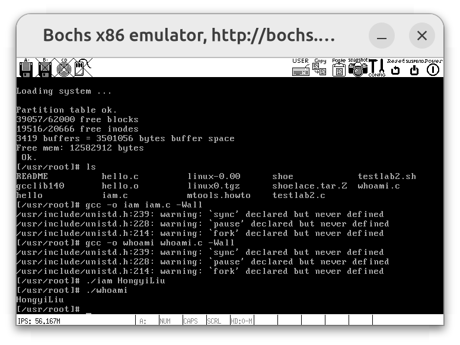
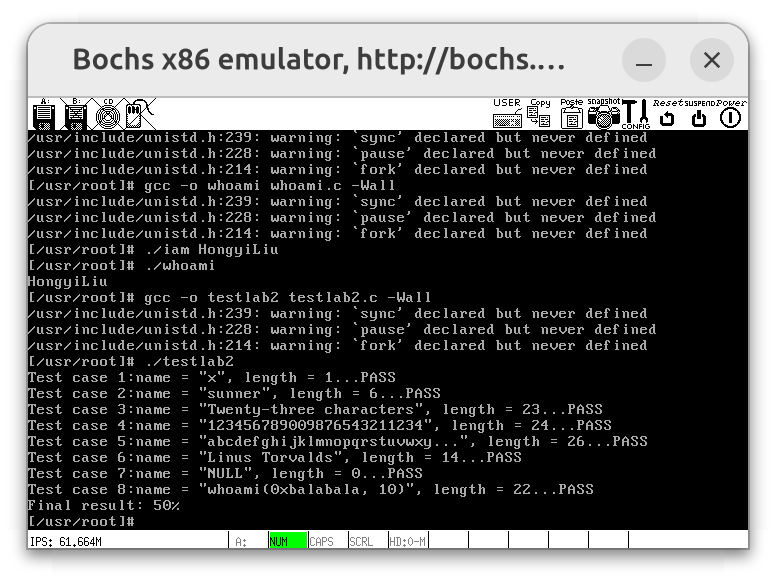
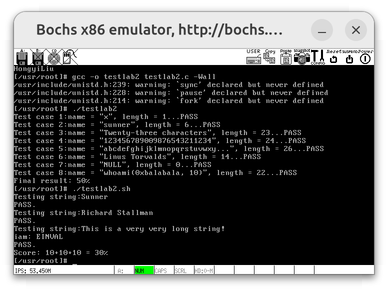

# Lab 4 系统调用

## 实验内容

在 `Linux 0.11` 上添加两个系统调用，并编写两个简单的应用程序测试它们。

### `iam()`

第一个系统调用是 `iam()`，其原型为：

```c
/**
 * @brief 将字符串参数 `name` 的内容拷贝到内核中保存下来。
 *
 * @param name 要拷贝的字符串，长度不能超过 23 个字符。
 * @return 返回拷贝的字符数。如果 `name` 的字符个数超过了 23，则返回 -1，并置 `errno` 为 `EINVAL`。
 */
int iam(const char *name);
```

在 `kernal/who.c` 中实现此系统调用。

### `whoami()`

第二个系统调用是 `whoami()`，其原型为：

```c
/**
 * @brief 将内核中由 `iam()` 保存的名字拷贝到 `name` 指向的用户地址空间中。
 *
 * @param name 指向用户地址空间的字符数组，用于存储拷贝的名字。
 * @param size `name` 数组的大小，用于防止越界访问。
 * @return 返回拷贝的字符数。如果 `size` 小于需要的空间，则返回 -1，并置 `errno` 为 `EINVAL`。
 */
int whoami(char* name, unsigned int size);
```

在 `kernal/who.c` 中实现。

### 测试程序

运行添加过新系统调用的 `Linux 0.11`，在其环境下编写两个测试程序 `iam.c` 和 `whoami.c`。最终的运行结果是：

```bash
./iam <name>
./whoami
# <name>
```

## 实验过程

要在 Linux 0.11 中实现 `iam()` 和 `whoami()` 系统调用，可按照以下步骤进行：

1. 在 `include/unistd.h` 中定义系统调用号
2. 在 `kernel/system_call.s` 修改系统调用总数
3. 在新文件 `kernel/who.c` 中实现系统调用
4. 在 `include/linux/sys.h` 中添加到系统调用表
5. 修改 `kernel/Makefile`

系统调用实现后，继续编写用户测试程序 `iam.c` 与 `whoami.c`，具体步骤如下：

1. 实现 `iam.c` 与 `whoami.c`
2. 挂载与卸载 `Linux 0.11` 文件系统
3. 编译运行 `Linux 0.11` 中的测试程序

### 在 `include/unistd.h` 中定义系统调用号

系统调用号是操作系统内核用来识别不同系统调用的唯一标识符。每个系统调用都有一个对应的编号，当用户程序调用系统调用时，这个编号会被存储在寄存器中，并通过中断机制传递给内核。内核根据这个编号来确定具体调用哪个系统调用函数。在 Linux 0.11 中，系统调用号定义在 `include/unistd.h` 文件中。我们为新的系统调用 `iam` 和 `whoami` 分配了编号 `72` 和 `73`。

```c
/* include/unistd.h */
/* 在现有系统调用号的末尾添加以下行 */
#define __NR_iam    72
#define __NR_whoami 73
```

### 在 `kernel/system_call.s` 修改系统调用总数

`nr_system_calls` 是系统调用的总数，用于在系统调用入口处检查调用号的有效性。我们添加了两个新的系统调用，因此，需要将总数从 `72` 更新为 `74`。这样，系统调用处理程序在处理 `int 0x80` 中断时，就能正确地识别并调用新的系统调用。

```assembly
/* kernel/system_call.s */
nr_system_calls = 74 # 增加了两个系统调用 (74 = 72 + 2)
```

### 在 `kernel/who.c` 中实现系统调用

在 `kernel` 目录下新建文件 `who.c`，实现这两个系统调用，具体实现如下：

```c
/* kernel/who.c */
#include <asm/segment.h>  /* 使用 get_fs_byte 和 put_fs_byte */
#include <errno.h>        /* 使用 EINVAL 错误码 */

#define MAX_NAME_LEN 23  /* 最大名称长度为 23 */

static char stored_name[MAX_NAME_LEN + 1] = {0};  /* 用于存储名字的静态数组 */

/**
 * @brief 将字符串参数 `name` 的内容拷贝到内核中保存下来。
 *
 * @param name 要拷贝的字符串，长度不能超过 23 个字符。
 * @return 返回拷贝的字符数。如果 `name` 的字符个数超过了 23，则返回 -1，并置
 * `errno` 为 `EINVAL`。
 */
int sys_iam(const char *name) {
    char ch;
    int len;

    /* 首先检查 name 的长度是否超过 MAX_NAME_LEN */
    for (len = 0; len <= MAX_NAME_LEN; len++) {
        ch = get_fs_byte(name + len);  /* 从用户空间获取字符 */
        if (ch == '\0') {              /* 如果是字符串结束符 */
            break;                     /* 结束循环 */
        }
    }

    if (len > MAX_NAME_LEN) {  /* 如果超过最大长度 */
        return -EINVAL;        /* 返回错误 */
    }

    /* 重新遍历 name 并将其存储到 stored_name 中 */
    for (len = 0; len <= MAX_NAME_LEN; len++) {
        ch = get_fs_byte(name + len);  /* 从用户空间获取字符 */
        stored_name[len] = ch;         /* 将字符存入内核空间 */
        if (ch == '\0') {              /* 如果是字符串结束符 */
            break;                     /* 结束循环 */
        }
    }

    return len;  /* 返回拷贝的字符数 */
}

/**
 * @brief 将内核中由 `iam()` 保存的名字拷贝到 `name` 指向的用户地址空间中。
 *
 * @param name 指向用户地址空间的字符数组，用于存储拷贝的名字。
 * @param size `name` 数组的大小，用于防止越界访问。
 * @return 返回拷贝的字符数。如果 `size` 小于需要的空间，则返回 -1，并置 `errno`
 * 为 `EINVAL`。
 */
int sys_whoami(char *name, unsigned int size) {
    int len = 0;  /* 名字长度 */

    while (stored_name[len] != '\0') {  /* 遍历已存储的名字 */
        len++;                          /* 计算已存储名字的长度 */
    }
    if (size < len + 1) {  /* 如果提供的缓冲区太小 */
        return -EINVAL;    /* 返回错误 */
    }
    for (int i = 0; i <= len; i++) {
        put_fs_byte(stored_name[i], name + i);  /* 将名字拷贝到用户空间 */
    }
    return len;  /* 返回拷贝的字符数 */
}
```

各行代码含义均以注释形式给出，不再赘述。值得注意的是，`sys_iam` 的逻辑应是先检查 `name` 的长度是否超过 `MAX_NAME_LEN`，如果超过，则直接返回错误，不应当修改 `stored_name`。否则，会导致 `testlab.sh` 第三条测试不过通过：

```bash
[/usr/root]# ./testlab2.sh
Testing string:Sunner
PASS.
Testing string:Richard Stallman
PASS.
Testing string:This is a very very long string!
FAILED
Score:10+10+0 = 20%
```

### 在 `include/linux/sys.h` 中添加到系统调用表

系统调用表是一个函数指针数组，内核通过系统调用号在这个数组中查找对应的系统调用函数。我们在 `sys_call_table` 系统调用表中添加了 `sys_iam` 和 `sys_whoami`，并确保它们的位置与系统调用号一致。

```c
/* include/linux/sys.h */
extern int sys_iam(const char *name);
extern int sys_whoami(char *name, unsigned int size);

/* 将新的系统调用添加到系统调用表 */
fn_ptr sys_call_table[] = {
    /* 现有的系统调用 */
    sys_iam,       /* __NR_iam = 72 */
    sys_whoami,    /* __NR_whoami = 73 */
};
```

### 修改 `kernel/Makefile`

`Makefile` 文件定义了内核的编译规则。我们需要将新的源文件 `who.c` 添加到编译列表中，以确保它能够被编译并链接到内核中。通过在 `OBJS` 变量中添加 `who.o`，我们可以确保 `who.c` 文件被正确编译并包含在内核中。

```makefile
OBJS = sched.o system_call.o traps.o asm.o fork.o \
       panic.o printk.o vsprintf.o sys.o exit.o \
       signal.o mktime.o who.o
```

除此之外，还需要添加依赖库：

```makefile
### Dependencies:
who.s who.o: who.c ../include/errno.h ../include/asm/system.h
```

### 实现 `iam.c` 与 `whoami.c`

接下来，实现用户测试程序。

```c
/* iam.c */
#define __LIBRARY__  /* 启用内嵌的系统调用定义 */

#include <errno.h>   /* 用于处理错误码 */
#include <stdio.h>   /* 用于标准输入输出 */
#include <unistd.h>  /* 用于系统调用接口 */

_syscall1(int, iam, const char *, name);  /* 定义 iam 系统调用 */

int main(int argc, char *argv[]) {
    int result;  /* 定义变量用于存储系统调用的返回值 */

    if (argc != 2) {  /* 检查命令行参数的数量是否正确 */
        fprintf(stderr, "Usage: %s <name>\n", argv[0]);  /* 打印使用方法 */
        return 1;  /* 返回 1 表示程序执行失败 */
    }

    result = iam(argv[1]);  /* 调用 iam 系统调用，将名字存储到内核中 */
    if (result == -1) {  /* 如果系统调用返回 -1，表示出错 */
        perror("iam");  /* 打印错误信息 */
        return 1;  /* 返回 1 表示程序执行失败 */
    }

    return 0;  /* 返回 0 表示程序执行成功 */
}
```

```c
/* whoami.c */
#define __LIBRARY__  /* 启用内嵌的系统调用定义 */

#include <errno.h>   /* 用于处理错误码 */
#include <stdio.h>   /* 用于标准输入输出 */
#include <unistd.h>  /* 用于系统调用接口 */

_syscall2(int, whoami, char*, name, unsigned int, size);  /* 定义 whoami 系统调用 */

#define MAX_NAME_LEN 23  /* 定义最大名称长度为 23 */

int main() {
    char name[MAX_NAME_LEN + 1] = {0};  /* 定义用于存储名字的缓冲区，并初始化为 0 */
    int result;  /* 定义变量用于存储系统调用的返回值 */

    result = whoami(name, MAX_NAME_LEN + 1);  /* 调用 whoami 系统调用，获取存储的名字 */

    if (result == -1) {  /* 如果系统调用返回 -1，表示出错 */
        perror("whoami");  /* 打印错误信息 */
        return 1;  /* 返回 1 表示程序执行失败 */
    }

    printf("%s\n", name);  /* 打印获取的名字 */
    return 0;  /* 返回 0 表示程序执行成功 */
}
```

各行代码含义均以注释形式给出，不再赘述。

### 挂载与卸载 Linux 0.11 文件系统

为了便于将测试程序等移至 Linux 0.11 文件系统下，我们进行挂载：

```bash
# 假设目前处于 src 目录下
./mount-hdc
```

挂载成功后，我们可以直接通过 `src/hdc` 访问 Linux 0.11 文件系统。接下来，进行文件拷贝：

```bash
# 假设目前处于 src 目录下
## src/test 目录包含用户测试程序 iam.c, whoami.c
cp test/* hdc/usr/root
## src/files 目录包含测试程序 testlab2.c, testlab2.sh
cp files/testlab2.* hdc/usr/root
## /usr/include/unistd.h 是标准头文件
## 和 linux 0.11 源码树中的 unistd.h 并非同一个文件
## 因此需要拷贝进去
cp linux-0.11/include/unistd.h hdc/usr/include
```

最后，在启动 Linux 0.11 内核前，卸载该文件系统：

```bash
# 假设目前处于 src 目录下
sudo umount hdc
```

### 编译运行 Linux 0.11 中的测试程序

做好前述准备工作后，我们先生成编译镜像文件 `Image`，再启动 Bochs 调试程序：

```bash
# 假设目前处于 src/linux-0.11 目录下
make all
# 编译成功后，回到 src 目录启动 Bochs 调试
cd ..
./dbg-bochs
# 在 Bochs 中让内核程序 continue 执行
c
```

此时，观察 Bochs Debugger 窗口，发现位于 Linux 0.11 的 `/usr/root` 目录下。接下来，进行编译运行，相关命令以及结果如下图所示：



由图可知，编译成功。同时，打印了我的名字（由于用户程序中打印时添加了回车，故与实验网站上略有差别）。实际上，第一次编译时，会产生以下错误：

```bash
/usr/include/unistd.h:210:parse error before '/'
/usr/inc1ude/unistd.h:212:parse error before '/'
```

检查 `unistd.h` 中 `210~212` 行代码：

```c
//volatile void exit(int status);
void _exit(int status);
//volatile void _exit(int status);
```

发现注释风格采用的是 `//...`。然而，当前 `gcc` 版本不支持此风格，故修改为 `/*... */` 注释风格：

```c
/* volatile void exit(int status); */
void _exit(int status);
/* volatile void _exit(int status); */
```

之后，便可编译成功。

接着，测试 `testlab2.c`，命令及结果如下图所示：



所有测试用例均通过，得分 `50%`。

最后，测试 `testlab2.sh`，命令及结果如下图所示：



所有测试用例均通过，得分 `30%`。

## 实验报告

1. 从 `Linux 0.11` 现在的机制看，它的系统调用最多能传递几个参数？
2. 你能想出办法来扩大这个限制吗？
3. 用文字简要描述向 `Linux 0.11` 添加一个系统调用 `foo()` 的步骤。

### Q1 系统调用参数传递机制

内核源代码在 `include/unistd.h` 文件中定义了宏函数 `_syscalln()`，其中 `n` 代表携带的参数个数，可以分别 0 至 3。因此，最多可以直接传递 3 个参数。宏函数相应定义如下：

```c
/* include/unistd.h */
#define _syscall0(type,name)
#define _syscall1(type,name,atype,a)
#define _syscall2(type,name,atype,a,btype,b)
#define _syscall3(type,name,atype,a,btype,b,ctype,c)
```

### Q2 扩大参数传递限制

要扩大 `Linux 0.11` 系统调用的参数传递限制，可以采用以下方法之一：

1. **使用内存传递参数**：将参数打包成一个结构体，并将该结构体的指针作为参数传递给系统调用。这样可以通过指针访问更多的参数。
2. **使用栈传递参数**：在用户空间将参数压入栈中，然后在内核中通过栈指针访问这些参数。这需要修改系统调用的入口代码，以便正确处理栈上的参数。
3. **使用共享内存**：在用户空间和内核空间之间建立共享内存区域，用户程序将参数写入共享内存，系统调用从共享内存中读取参数。这种方法适用于需要传递大量数据的情况。

这些方法都需要对内核和用户程序进行相应的修改，以确保参数能够正确传递和访问。

### Q3 系统调用添加步骤

1. 在 `include/unistd.h` 中定义系统调用号：例如 `#define __NR_foo 74`
2. 在 `kernel/system_call.s` 修改系统调用总数：更新 `nr_system_calls` 的值，例如 `nr_system_calls = 75`
3. 在新文件 `kernel/foo.c` 中实现系统调用
4. 在 `include/linux/sys.h` 中添加到系统调用表：声明 `extern int sys_foo();`，并在 `sys_call_table[]` 中添加 `sys_foo`，确保其位置与系统调用号一致。
5. 修改 `kernel/Makefile`
