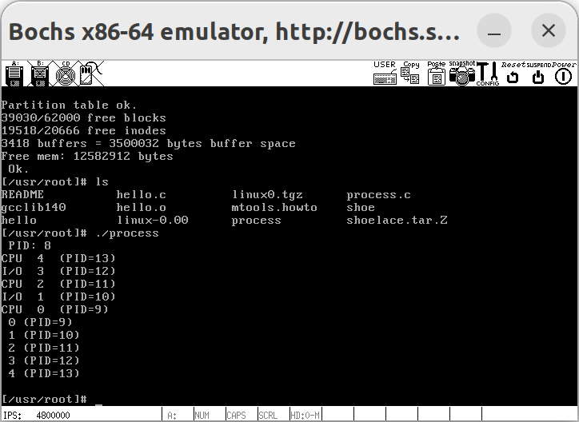
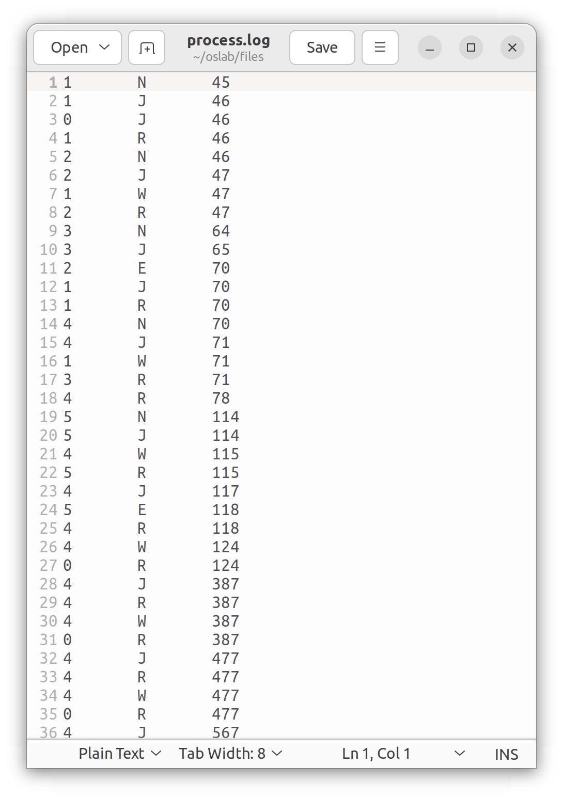
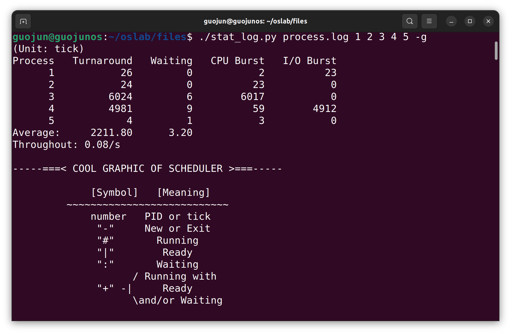
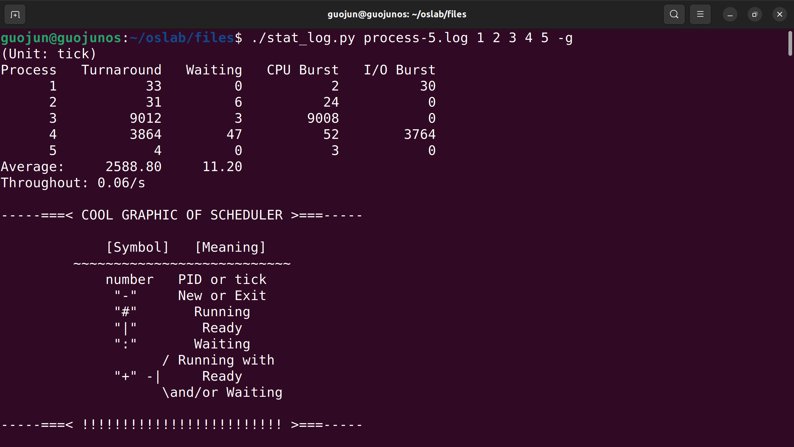
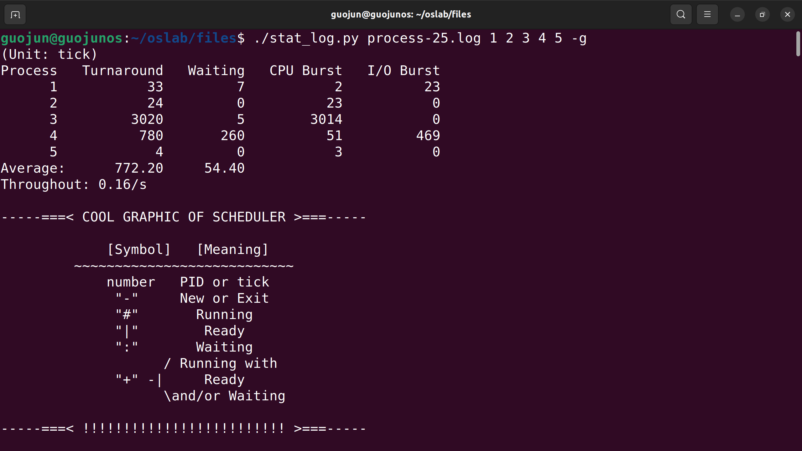
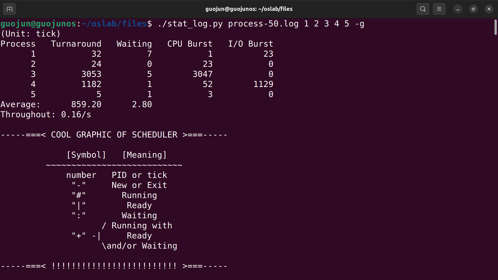
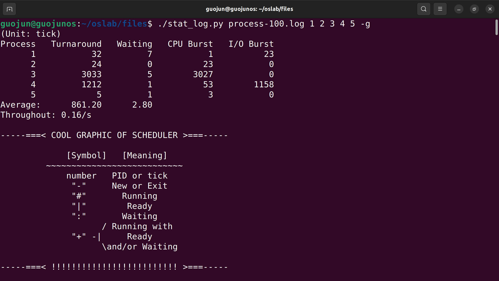
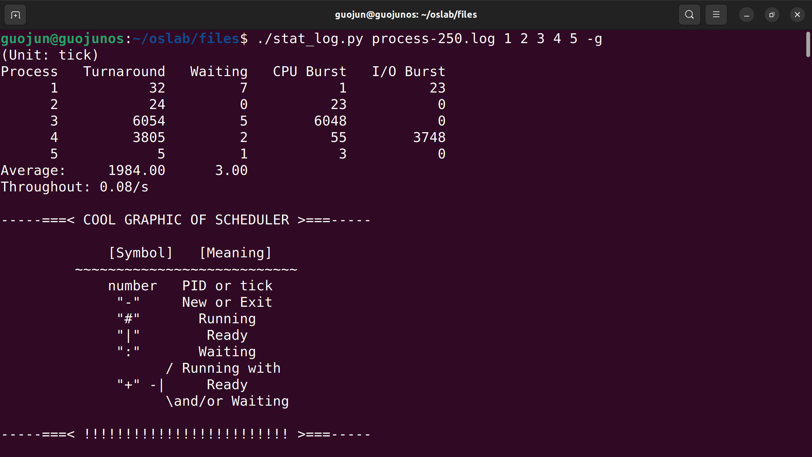

# Lab 5 进程运行轨迹的跟踪与统计

## 实验内容

1. 基于模板 `process.c` 编写多进程的样本程序，实现如下功能：
    - 所有子进程都并行运行，每个子进程的实际运行时间一般不超过 `30` 秒；
    - 父进程向标准输出打印所有子进程的 `id`，并在所有子进程都退出后才退出；
2. 在 `Linux 0.11` 上实现进程运行轨迹的跟踪。基本任务是在内核中维护一个日志文件 `/var/process.log`，把从操作系统启动到系统关机过程中所有进程的运行轨迹都记录在这一 `log` 文件中。
3. 在修改过的 `0.11` 上运行样本程序，通过分析 `log` 文件，统计该程序建立的所有进程的等待时间、完成时间（周转时间）和运行时间，然后计算平均等待时间，平均完成时间和吞吐量。可以自己编写统计程序，也可以使用 `python` 脚本程序 `stat_log.py` 进行统计。
4. 修改 `0.11` 进程调度的时间片，然后再运行同样的样本程序，统计同样的时间数据，和原有的情况对比，体会不同时间片带来的差异。

### 多进程样本程序的编写

`process.c` 实现如下：

```c
#include <stdio.h>
#include <stdlib.h>
#include <sys/times.h>
#include <sys/types.h>
#include <sys/wait.h>
#include <time.h>
#include <unistd.h>

#define HZ 100      /* 时钟频率 */
#define NUM_CHILD 5 /* 子进程数量 */

void cpuio_bound(int last, int cpu_time, int io_time);

int main(int argc, char* argv[]) {
    pid_t pid[NUM_CHILD]; /* 子进程 PID */
    int i;                /* 第 i 个子进程 */

    printf("父进程 PID: %d\n", getpid());

    /* 创建 NUM_CHILD (i.e. 5) 个子进程 */
    for (i = 0; i < NUM_CHILD; i++) {
        pid[i] = fork();  /* 创建子进程 */
        if (pid[i] < 0) { /* 创建失败 */
            perror("Fork 失败");
            exit(1);
        }
        if (pid[i] == 0) {    /* 子进程  */
            if (i % 2 == 0) { /* 偶数进程为 CPU 密集型 */
                printf("CPU 密集型进程 %d 启动 (PID=%d)\n", i, getpid());
                cpuio_bound(10, 1, 0); /* CPU 密集型: 10 秒纯计算 */
            } else {                   /* 奇数进程为 I/O 密集型 */
                printf("I/O 密集型进程 %d 启动 (PID=%d)\n", i, getpid());
                cpuio_bound(10, 1, 9); /* I/O 密集型: CPU:IO = 1:9 */
            }
            exit(0); /* 子进程结束 */
        }
    }

    /* 父进程等待所有子进程结束 */
    for (i = 0; i < NUM_CHILD; i++) {
        wait(NULL);
        printf("子进程 %d (PID=%d) 已结束\n", i, pid[i]);
    }

    printf("所有子进程已结束\n");
    return 0;
}

void cpuio_bound(int last, int cpu_time, int io_time) {
    ...
}
```

对于两种进程类型的设计如下：

| 进程类型      | 函数调用                    | 总运行时间 | CPU 计算时间 | I/O 操作时间 |
|:-------- | ----------------------- | ----- | -------- | -------- |
| CPU 密集型进程 | `cpuio_bound(10, 1, 0)` | 10    | 1        | 0        |
| I/O 密集型进程 | `cpuio_bound(10, 1, 9)` | 10    | 1        | 9        |

接下来，分析调用流程：

1. 进程创建 (fork)
    1. 父进程调用 `fork()`:
        - 复制父进程的地址空间
        - 创建新的进程描述符
        - 为子进程分配新的 PID
    2. 子进程执行:
        - 根据进程序号选择进程类型
        - 执行 `cpuio_bound()` 函数
        - 通过 `exit(0)` 正常退出
2. 进程同步 (wait)
    - 父进程阻塞直到指定子进程退出
    - 子进程退出时向父进程发送 SIGCHLD 信号
    - 内核清理子进程资源
    - 父进程继续执行

### 日志文件的维护

#### 打开 `log` 文件

操作系统启动后，先要打开 `/var/process.log`，然后在每个进程发生状态切换的时候向 `log` 文件内写入一条记录。为了能尽早开始记录，在内核启动时就打开 `log` 文件。内核的入口是 `init/main.c` 中的 `main()`，现修改 `init()` 中部分代码如下：

```c
move_to_user_mode();
/********************************CODE*******************************/
setup((void *) &drive_info);      // 加载文件系统
(void) open("/dev/tty0",O_RDWR);  // 打开/dev/tty0，建立文件描述符0和/dev/tty0的关联
(void) dup(0);                    // 让文件描述符1也和/dev/tty0关联
(void) dup(0);                    // 让文件描述符2也和/dev/tty0关联
(void) open("/var/process.log", O_CREAT|O_TRUNC|O_WRONLY, 0666); // 打开/var/process.log文件
/*******************************************************************/
if (!fork()) {
    init();
}
```

其中，打开 `/var/process.log` 函数参数解析如下：

- `O_CREAT`: 如果文件不存在则创建
- `O_TRUNC`: 如果文件存在则清空
- `O_WRONLY`: 只写模式
- `0666`: 文件权限 (`rw-rw-rw-`)

#### 写 `log` 文件

`log` 文件将被用来记录进程的状态转移轨迹，而所有的状态转移都是在内核进行的。在内核状态下，`write()` 功能失效，只能调用 `printk()`。因此，将实验指导中的 `fprintk()` 写入 `kernel/printk.c` 中。

```c
#include <linux/sched.h>
#include <sys/stat.h>

static char logbuf[1024];
int fprintk(int fd, const char *fmt, ...) {
    // ...
}
```

### 进程运行轨迹的跟踪

总的来说，`Linux 0.11` 支持四种进程状态的转移：就绪到运行、运行到就绪、运行到睡眠和睡眠到就绪，此外还有新建和退出两种情况。其中：

- 就绪与运行间的状态转移是通过 `schedule()`（它亦是调度算法所在）完成的；
- 运行到睡眠依靠的是 `sleep_on()` 和 `interruptible_sleep_on()`，还有进程主动睡觉的系统调用 `sys_pause()` 和 `sys_waitpid()`；
- 睡眠到就绪的转移依靠的是 `wake_up()`。所以只要在这些函数的适当位置插入适当的处理语句就能完成进程运行轨迹的全面跟踪了。

首先，概述 Linux 0.11 中的进程状态：

- **N**（New）：进程创建（`TASK_RUNNING` 状态）。
- **J**（Ready/Just ready）：进程进入就绪态（`TASK_RUNNING` 状态）。
- **R**（Running）：进程被调度运行。
- **W**（Waiting）：进程进入等待/阻塞态（`TASK_INTERRUPTIBLE` 或 `TASK_UNINTERRUPTIBLE` 状态）。
- **E**（Exit）：进程退出。

具体地，在 `include/linux/shed.h` 中定义如下：

```c
#define TASK_RUNNING 0            // 运行态
#define TASK_INTERRUPTIBLE 1      // 可中断阻塞态
#define TASK_UNINTERRUPTIBLE 2    // 不可中断阻塞态
#define TASK_ZOMBIE 3             // 僵死态
#define TASK_STOPPED 4            // 停止
```

其次，确定这些状态转换在代码中的位置：

- **进程创建（N-J）**：在 `kernel/fork.c` 的 `copy_process()` 函数中。
- **进程调度运行（J-R）**：在 `kernel/sched.c` 的 `schedule()` 函数中。
- **进程阻塞（R-W）**：在 `kernel/sched.c` 的 `sleep_on()`、`interruptible_sleep_on()`、`sys_pause()`、`sys_waitpid()` 等函数中。
- **进程唤醒（W-J）**：在 `kernel/sched.c` 的 `wake_up()` 函数中。
- **进程退出（E）**：在 `kernel/exit.c` 的 `do_exit()` 函数中。

#### `kernel/fork.c`

`copy_process()` 流程大致如下：

1. **内存分配**：使用 `get_free_page()` 获取一个空闲页，用于存储新的 `task_struct`（任务结构体）。
2. **PCB 初始化**：
    - 将新获取的页指针赋值给 `task[nr]`，表示任务表中的一个槽位。
    - 复制当前任务的结构体到新任务中，使用 `*p = *current;`。
    - 初始化新任务的字段，如状态、PID、父 PID、信号、时间等。
3. **TSS 配置**：配置新任务的 TSS（任务状态段），设置寄存器值和段选择符等
4. **内存复制**：调用 `copy_mem(nr, p)` 复制内存空间，建立新进程的内存映射。
5. **资源管理**：增加文件描述符、当前工作目录、根目录和可执行文件的引用计数。
6. **GDT 更新**：更新 GDT（全局描述符表）中的 TSS 和 LDT 描述符，确保新进程正确访问资源。
7. **进程状态设置**：将新进程的状态设置为 `TASK_RUNNING`，表示它可以被调度运行。

因此，当 PCB 初始化后，即：`p->start_time = jiffies;` 设置后，进程完成创建，进入状态 `N`。当 TSS，GDT 等配置后，进程进入 `J`。故日志记录如下：

```c
int copy_process(...) {
    p->start_time = jiffies;
    /********************************CODE*******************************/
    fprintk(3, "%ld\t%c\t%ld\n", last_pid, 'N', jiffies);
    /*******************************************************************/
    p->tss.back_link = 0;
    ...
    p->state = TASK_RUNNING;	/* do this last, just in case */
    /********************************CODE*******************************/
    fprintk(3, "%ld\t%c\t%ld\n", last_pid, 'J', jiffies);
    /*******************************************************************/
    return last_pid;
}
```

#### `kernel/sched.c`

##### J ↔ R

就绪态与运行态的转移通过调度函数 `schedule()` 实现，基本流程如下：

1. **检查闹钟和信号，唤醒可运行的进程**：对应 `for(p = &LAST_TASK; p > &FIRST_TASK; --p)` 循环相关代码。
    - 遍历所有进程，检查是否有闹钟到期的进程，如果有，则向其发送 `SIGALRM` 信号。
    - 检查是否有进程处于可中断睡眠状态（`TASK_INTERRUPTIBLE`）且收到未被阻塞的信号，如果有，则将其状态设置为就绪态（`TASK_RUNNING`）。在状态变更后，记录进程进入就绪态 `J` 的日志
2. **调度算法，选择下一个要运行的进程**：对应 `while (1)` 循环相关代码
    - **内层循环**：遍历所有进程，寻找状态为就绪态（`TASK_RUNNING`）且时间片（`counter`）值最大的进程，记录其索引 `next` 和 `counter` 值 `c`。
    - **外层循环**：如果找到可运行的进程（`c > 0`），则退出循环；否则，重新计算所有进程的 `counter` 值（动态优先级调整）。
3. **任务切换**：对应 `switch_to(next);`

对于调度算法，只是确定了下一个要运行的进程，此时还未进行进程状态的改变。因此，在上述 `Step 2` 与 `Step 3` 间判断下一个要运行的进程是否与当前进程不同，如果不同，说明需要进行进程切换。相关日志记录如下：

- 在切换前，记录当前运行进程（`current`）的状态转换为就绪态（状态 `J`）
- 记录下一个将要运行的进程（`task[next]`）的状态转换为运行态（状态 `R`）

以上所有代码的实现如下：

```c
void schedule(void)
{
    int i, next, c;
    struct task_struct **p;

    /* check alarm, wake up any interruptible tasks that have got a signal */

    for (p = &LAST_TASK; p > &FIRST_TASK; --p)
        if (*p) {
            if ((*p)->alarm && (*p)->alarm < jiffies) {
                (*p)->signal |= (1 << (SIGALRM - 1));
                (*p)->alarm = 0;
            }
            if (((*p)->signal & ~(_BLOCKABLE & (*p)->blocked)) &&
                (*p)->state == TASK_INTERRUPTIBLE) {
                (*p)->state = TASK_RUNNING;
            /*****************************CODE***************************/
            fprintk(3, "%ld\t%c\t%ld\n", (*p)->pid, 'J', jiffies);
            /************************************************************/
            }
        }

    /* this is the scheduler proper: */

    while (1) {
        c = -1;
        next = 0;
        i = NR_TASKS;
        p = &task[NR_TASKS];
        while (--i) {
            if (!*--p)
                continue;
            if ((*p)->state == TASK_RUNNING && (*p)->counter > c)
                c = (*p)->counter, next = i;
        }
        if (c) break;
        for (p = &LAST_TASK; p > &FIRST_TASK; --p)
            if (*p)
                (*p)->counter = ((*p)->counter >> 1) +
                                (*p)->priority;
    }
    /********************************CODE*******************************/
    if (task[next]->pid != current->pid) {
        if (current->state == TASK_RUNNING) {
            fprintk(3, "%ld\t%c\t%ld\n", current->pid, 'J', jiffies);
        }
        fprintk(3, "%ld\t%c\t%ld\n", task[next]->pid, 'R', jiffies);
    }
    /*******************************************************************/
    switch_to(next);
}
```

##### R → W 与 W → J

运行态到睡眠态的转移在 `sleep_on()`, `interruptible_sleep_on()` 中实现。

`sleep_on()` 使当前进程进入不可中断的睡眠状态（`TASK_UNINTERRUPTIBLE`），直到被其他进程显式地唤醒。这种睡眠状态下，进程不会响应信号，只有当等待的事件发生时，才会被唤醒。接下来，对日志记录位置进行分析：

- 当前进程（`current`）：在设置 `current->state = TASK_UNINTERRUPTIBLE;` 后，运行态（R）-> 等待态（W）
- 等待队列中的下一个进程（`tmp`）：在当前进程被唤醒后，原等待队列中的下一个进程等待态（W）-> 就绪态（J）

代码实现如下：

```c
void sleep_on(struct task_struct **p)
{
    struct task_struct *tmp;

    if (!p)
        return;
    if (current == &(init_task.task))
        panic("task[0] trying to sleep");
    tmp = *p;
    *p = current;
    current->state = TASK_UNINTERRUPTIBLE;
    /********************************CODE*******************************/
    fprintk(3, "%ld\t%c\t%ld\n", current->pid, 'W', jiffies);
    /*******************************************************************/
    schedule();
    if (tmp) {
        tmp->state=0;
        /*****************************CODE***************************/
        fprintk(3, "%ld\t%c\t%ld\n", tmp->pid, 'J', jiffies);
        /************************************************************/
    }
}
```

`interruptible_sleep_on()` 使当前进程进入可中断的睡眠状态（`TASK_INTERRUPTIBLE`），等待特定事件的发生。与 `sleep_on` 不同的是，只有在被唤醒进程与阻塞队列队首进程恰好相同时，才可唤醒。接下来，对日志记录位置进行分析：

- 当前进程（`current`）：在 `current->state = TASK_INTERRUPTIBLE;` 后，运行态（R）-> 等待态（W）
- 等待队列中的其他进程（`tmp`）：在被唤醒时，等待态（W）-> 就绪态（J）

代码实现如下：

```c
void interruptible_sleep_on(struct task_struct **p)
{
    struct task_struct *tmp;

    if (!p)
        return;
    if (current == &(init_task.task))
        panic("task[0] trying to sleep");
    tmp = *p;
    *p = current;
repeat:
    current->state = TASK_INTERRUPTIBLE;
    /********************************CODE*******************************/
    fprintk(3, "%ld\t%c\t%ld\n", current->pid, 'W', jiffies);
    /*******************************************************************/
    schedule();
    if (*p && *p != current) {
        (**p).state = 0;
        /*****************************CODE***************************/
        fprintk(3, "%ld\t%c\t%ld\n", (*p)->pid, 'J', jiffies);
        /************************************************************/
        goto repeat;
    }
    *p = NULL;
    if (tmp) {
        tmp->state = 0;
        /*****************************CODE***************************/
        fprintk(3, "%ld\t%c\t%ld\n", tmp->pid, 'J', jiffies);
        /************************************************************/
    }
}
```

`wake_up()` 负责将等待队列中第一个进程唤醒，从等待态（W）-> 就绪态（J）。日志记录如下：

```c
void wake_up(struct task_struct **p)
{
    if (p && *p) {
        /*****************************CODE***************************/
        if ((**p).state != 0) {
            fprintk(3, "%ld\t%c\t%ld\n", (*p)->pid, 'J', jiffies);
        }
        /************************************************************/
        (**p).state = 0;
        *p = NULL;
    }
}
```

为了确保只有在进程状态确实发生变化时才记录日志，避免不必要的日志记录，添加条件判断，即：只有当进程的状态不是 `TASK_RUNNING`（即状态值不为 0）时，才记录其进入就绪态的日志。

最后，是 `sys_pause`。回顾操作系统启动后的执行流程：

- 系统启动
- 没有其他进程需要运行
- 进程 0 执行
- 调用 `sys_pause()`
- 等待中断或其他进程就绪
- 重复此循环

当操作系统没有其他进程需要运行时执行，内核中主要执行 `sys_pause()`，不断调用 `schedule()` 寻找可运行进程，实现 CPU 空闲时的循环等待。因此，进程 0 频繁在运行态和等待态之间切换，记录这些状态变化会产生大量无意义的日志。故日志记录时，需排除进程 0。

```c
int sys_pause(void)
{
    current->state = TASK_INTERRUPTIBLE;
    if (current->state != TASK_INTERRUPTIBLE)
        fprintk(3, "%ld\t%c\t%ld\n", current->pid, 'W', jiffies);
    schedule();
    return 0;
}
```

#### `kernel/exit.c`

`exit.c` 中需要修改两处：

- `do_exit()`：处理进程的退出操作。释放进程占用的资源，更新进程状态，并通知父进程。在将进程状态设置为僵死态之后，记录日志。
- `sys_waitpid()`：等待子进程的状态变化（如退出或停止）。可以选择性地等待特定的子进程，并返回子进程的状态信息。在将进程状态设置为可中断等待态之后，记录日志。

具体实现如下：

```c
int do_exit(long code)
{
    ...
    current->state = TASK_ZOMBIE;
    /********************************CODE*******************************/
    fprintk(3, "%ld\t%c\t%ld\n", current->pid, 'E', jiffies);
    /*******************************************************************/
    current->exit_code = code;
    tell_father(current->father);
    schedule();
    return (-1); /* just to suppress warnings */
}

int sys_waitpid(pid_t pid, unsigned long *stat_addr, int options)
{
    ...
    if (flag) {
        if (options & WNOHANG)
            return 0;
        current->state = TASK_INTERRUPTIBLE;
        /********************************CODE*******************************/
        fprintk(3, "%ld\t%c\t%ld\n", current->pid, 'W', jiffies);
        /*******************************************************************/
        schedule();
        if (!(current->signal &= ~(1 << (SIGCHLD - 1))))
            goto repeat;
        else
            return -EINTR;
    }
    return -ECHILD;
}
```

### 进程调度时间片的修改

fork 新进程时，新进程会复制父进程的 counter, priority。后续进程运行时间片用完后，根据自身 counter, priority 重新计算。因此，仅需修改进程 0 初始化的 counter, priority 即可。响应代码位于 `include/linux/sched.h`：

```c
#define INIT_TASK \
/* state etc */	{ 0,15,15, \
// 以上三个值分别对应 state, counter, priority;
```

不妨修改 priority 分别为：5, 25, 50, 100, 250

## 实验结果

### 挂载与卸载 Linux 0.11 文件系统

为了便于将测试程序等移至 Linux 0.11 文件系统下，我们进行挂载：

```bash
# 假设目前处于 oslab 目录下
./mount-hdc
```

挂载成功后，我们可以直接通过 `oslab/hdc` 访问 Linux 0.11 文件系统。接下来，进行文件拷贝：

```bash
# 假设目前处于 oslab 目录下
# oslab/files 目录测试程序 process.c
cp files/process.c hdc/usr/root
```

最后，在启动 Linux 0.11 内核前，卸载该文件系统：

```bash
# 假设目前处于 src 目录下
sudo umount hdc
```

### 编译运行 Linux 0.11 中的测试程序

前述准备工作完成后，先生成编译镜像文件 `Image`，再启动 Bochs 调试程序：

```bash
# 假设目前处于 oslab/linux-0.11 目录下
make all
# 编译成功后，回到 oslab 目录启动 Bochs 调试
cd ..
./dbg-bochsgui246 # 运行低版本 Bochs 进行 debug
# 在 Bochs 中让内核程序 continue 执行
c
```

Bochs 中编译运行 `process`，如下图所示：



注意：此处编译已经在第一次进行，后续只有运行过程。

### 进程运行日志的统计

将日志文件从 Linux 0.11 `/var/process.log` 移至宿主机 `~/oslab/files` 目录 下。打开 `process.log`，如下图所示：



可见，日志中五种状态均有包含。接下来，运行 `stat_log.py` 进行分析，如下图所示：



### 不同时间片下的日志统计

多次修改时间片，priority 分别设置为：5, 15, 25, 50, 100, 250。生成的日志文件命名为 `process-<priority>.log`。运行 `stat_log.py` 如下：











具体分析见 `实验报告` 一节

## 实验报告

1. 结合自己的体会，谈谈从程序设计者的角度看，单进程编程和多进程编程最大的区别是什么？
2. 你是如何修改时间片的？仅针对样本程序建立的进程，在修改时间片前后，`log` 文件的统计结果（不包括 Graphic）都是什么样？结合你的修改分析一下为什么会这样变化，或者为什么没变化？

### Q1: 单进程编程和多进程编程

| 比较       | 单进程编程                                   | 多进程编程                                          |
|:------- |:-------------------------------------- |:--------------------------------------------- |
| 并行性与并发性  | 依赖多线程或异步编程实现并发，受全局解释器锁限制，无法充分利用多核处理器。| 充分利用多核处理器，实现真正的并行执行，每个进程独立运行，互不干扰，提高执行效率和响应能力。|
| 资源隔离与安全性 | 所有任务共享同一内存空间，易导致资源竞争和数据冲突，需精细同步机制保证一致性。| 每个进程拥有独立内存空间，天然隔离，增强程序稳定性和安全性，一个进程崩溃不影响其他进程。|
| 复杂性与调试   | 共享内存和资源管理集中，代码结构相对简单，调试和维护较容易。| 涉及进程间通信（IPC）、进程同步等复杂问题，增加设计和调试难度，但能更好利用系统资源。|
| 扩展性与可维护性 | 面对大型复杂应用时，单一进程难以有效扩展，模块化程度有限。| 通过分解为多个独立进程实现模块化设计，便于扩展和维护，适应复杂系统需求。|
| 系统资源消耗   | 通常消耗较少系统资源，适合资源受限环境。| 每个进程有独立资源开销，需合理管理以避免资源浪费。|

### Q2: 不同时间片下的日志统计

fork 新进程时，新进程会复制父进程的 counter, priority。后续进程运行时间片用完后，根据自身 counter, priority 重新计算。因此，仅需修改进程 0 初始化的 counter, priority 即可。响应代码位于 `include/linux/sched.h`：

```c
#define INIT_TASK \
/* state etc */	{ 0,15,15, \
// 以上三个值分别对应 state, counter, priority;
```

实际上，时间片只与 priority 有关，本实验分别设置为：5, 15, 25, 50, 100, 250。实验结果见 `实验内容-不同时间片下的日志统计` 一节。此处只对结果进行分析。

| `priority` | Throughtout/s |
| ---------- | ------------- |
| 5          | 0.06          |
| 15         | 0.08          |
| 25         | 0.16          |
| 50         | 0.16          |
| 100        | 0.16          |
| 250        | 0.08          |

由表可知，吞吐量随着 `priority` 的增大，呈现先增后减的趋势。对结果分析如下：

- **时间片过小**：进程很快就会被挂起，从而被频繁调度切换，系统开销增大，降低了 CPU 利用率。
- **时间片过大**：某一进程可能长时间占用 CPU，导致其他进程等待时间过长，系统的响应速度变慢。进程调度切换次数减小，降低了系统并发性
